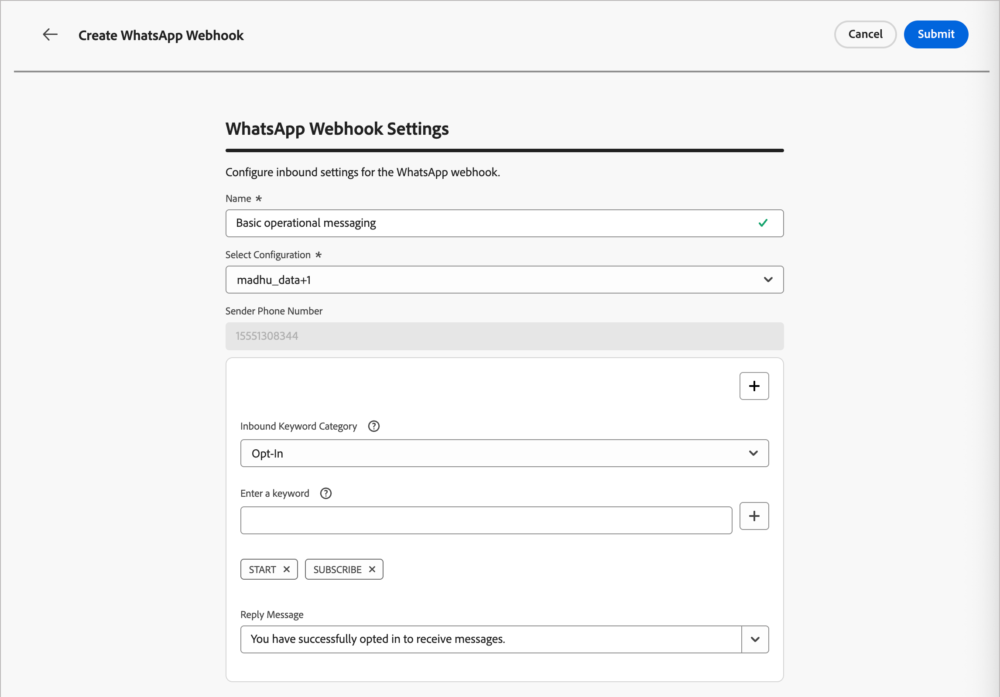
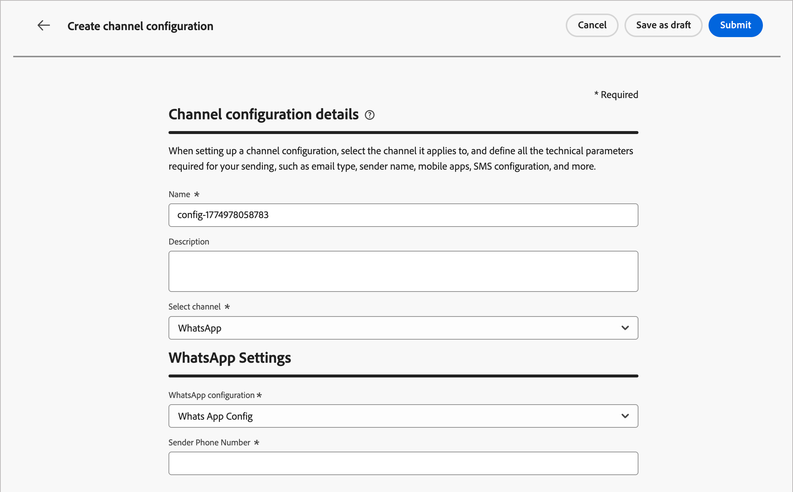

# WhatsApp渠道配置

Marketo Optimizer通过Meta的Cloud API发送WhatsApp消息。 在营销人员创建人员历程的WhatsApp消息之前，产品管理员必须配置WhatsApp渠道。

适用于Marketo Optimizer的

## 先决条件 {#prerequisites}

在配置WhatsApp渠道之前，请确保您具备以下条件：

* [Meta业务经理帐户](https://business.facebook.com/)
* [具有已验证的发件人姓名和电话号码的WhatsApp商业帐户](https://developers.facebook.com/docs/whatsapp/overview/business-accounts/)
* [具有相应权限的Meta用户授权令牌](https://developers.facebook.com/blog/post/2022/12/05/auth-tokens/)
* [您的WhatsApp商业帐户中的已批准消息模板](https://developers.facebook.com/docs/whatsapp/message-templates/guidelines/)

>[!IMPORTANT]
>
>您对WhatsApp消息传递服务的使用受Meta条款和条件的约束。 通过Marketo Optimizer访问WhatsApp消息传送，即表示您确认已查看并同意遵守[Meta WhatsApp业务政策](https://www.whatsapp.com/legal/business-policy/)。

## 限制 {#limitations}

以下限制适用于 WhatsApp 渠道：

* Adobe Marketo Optimizer **不符合HIPAA要求，并且不符合HIPAA要求**。 此外，第三方供应商不受Adobe BAA的约束。 客户需对合规性和供应商验证自行负责。

* 尚不支持自动或预定义的响应消息。

* 从2025年4月开始，Meta暂停向拥有美国电话号码（一个由+1拨号代码和美国区号组成的号码）的WhatsApp用户发送所有营销模板消息。 [在Meta文档中了解详情](https://developers.facebook.com/documentation/business-messaging/whatsapp/templates/marketing-templates/per-user-limits/)

* 原生集成功能不允许与第三方业务服务提供商 (BSP) 集成。

## 完成渠道配置 {#complete-channel-configuration}

在发送WhatsApp消息之前，必须配置Marketo Optimizer环境并将其与您的WhatsApp帐户连接。

完成以下任务：

1. [创建WhatsApp API凭据](#create-whatsapp-api-credentials)
1. [添加 WhatsApp Webhook](#configure-webhooks)
1. [创建WhatsApp渠道配置](#create-channel-configuration)

### 创建 WhatsApp API 凭据 {#create-whatsapp-api-credentials}

>[!NOTE]
>
>所述设置仅供具有管理员权限的用户访问。

1. 在左侧导航栏中，展开&#x200B;**[!UICONTROL 管理]**&#x200B;部分，然后单击&#x200B;**[!UICONTROL 渠道]**。

1. 在面板中，展开&#x200B;**[!UICONTROL WhatsApp设置]**&#x200B;并选择&#x200B;**[!UICONTROL API凭据]**。

   {width="800" zoomable="yes"}

1. 单击右上角的&#x200B;**[!UICONTROL 新建API凭据]**。

1. 配置API凭据，如下所述：

   * **[!UICONTROL 名称]** — 输入凭据的唯一名称
   * **[!UICONTROL API令牌]** — 输入您的API令牌。 有关信息，请参阅[Meta文档](https://developers.facebook.com/blog/post/2022/12/05/auth-tokens/)。
   * **[!UICONTROL 业务帐户ID]** — 输入与业务组合相关的唯一编号。 有关信息，请参阅[Meta文档](https://www.facebook.com/business/help/1181250022022158?id=180505742745347)。

   {width="500" zoomable="yes"}

1. 单击&#x200B;**[!UICONTROL 继续]**。

1. 选择要连接到WhatsApp API凭据的&#x200B;**[!UICONTROL WhatsApp商业帐户]**。

   {width="500" zoomable="yes"}

1. 选择用于发送WhatsApp消息的&#x200B;**[!UICONTROL 发件人名称]**。

   自动填充电话号码设置：

   * **质量评级** — 反映客户对过去24小时内发送的邮件的反馈。
     * 绿色：高品质
     * 黄色：Medium品质
     * 红色：低品质

     有关详细信息，请参阅Meta文档中的&#x200B;[_质量评级_](https://www.facebook.com/business/help/766346674749731#)。

   * **吞吐量** — 指示您的电话号码可以发送消息的速率。

1. 完成API凭据配置后，单击&#x200B;**[!UICONTROL 提交]**。

单击&#x200B;_[!UICONTROL 提交]_&#x200B;后，将立即验证并保存凭据，并将您重定向到&#x200B;_[!UICONTROL API凭据]_&#x200B;列表页面。

如果提交的凭据无效，则系统显示HTTP 500错误消息。 在这种情况下，您可以选择取消配置或更新配置并重新提交。

+++HTTP 500错误疑难解答

如果在配置WhatsApp API凭据时遇到HTTP 500错误，请按照以下故障排除步骤操作：

1. 验证您的Adobe授权 — 确认您的组织已配置&#x200B;_cjm_ whatsapp_权利。 如果没有此权限，无法配置WhatsApp渠道。

1. 验证业务帐户字段 — 确保所有必填字段均正确：

   * API令牌 — 必须是具有适当权限的有效[Meta访问令牌](https://developers.facebook.com/blog/post/2022/12/05/auth-tokens/)。
   * Business帐户ID — 必须与您的[Meta Business帐户ID](https://www.facebook.com/business/help/1181250022022158?id=180505742745347)完全匹配。

1. 外部测试凭据 — 直接使用Meta API验证您的凭据，以确认问题与凭据有关，还是与Marketo Optimizer凭据处理有关。

1. 联系Adobe — 如果环境和权利已确认有效，但HTTP 500错误仍然存在，请联系您的Adobe代表。

+++

### 添加 WhatsApp Webhook {#configure-webhooks}

>[!CONTEXTUALHELP]
>id="ajo-b2b-prime_admin-whatsapp-webhook-inbound-keyword-category"
>title="入站关键词类别"
>abstract="<b>选择加入</b>：用户订阅后，发送您定义的自动回复。  <b>选择退出</b>：用户取消订阅后，发送您定义的自动回复。  <b>帮助</b>：用户请求帮助或支持时，发送您定义的自动回复。  <b>默认</b>：关键词不匹配的情况下，发送您的备用自动回复。"

>[!CONTEXTUALHELP]
>id="ajo-b2b-prime_admin_whatsapp-webhook-inbound-keyword"
>title="输入您的关键词"
>abstract="您可以定义关键词，用于根据用户文本触发特定的自动响应。 关键词不区分大小写（stop 和 STOP 的效果是一样的）。"

>[!CONTEXTUALHELP]
>id="ajo-b2b-prime_admin-whatsapp-webhook-webhook-url"
>title="回调 URL"
>abstract="此对象的验证请求和 webhook 通知将被发送到指定的 URL。"

>[!CONTEXTUALHELP]
>id="ajo-b2b-prime_admin-whatsapp-webhook-verify-token"
>title="验证令牌"
>abstract="Meta 在验证过程中返回的用于确认和验证回调 URL 的令牌。"

通过Webhook，Marketo Optimizer可从您的WhatsApp商业帐户接收入站消息、同意响应和投放通知。 配置Webhook以确保正确的同意管理和消息跟踪。

>[!NOTE]
>
>如果没有指定的选择加入或选择退出关键词，则不会启用标准同意消息。

成功创建WhatsApp API凭据后，您可以配置Webhook。

1. 在导航面板中，选择&#x200B;**[!UICONTROL WhatsApp Webhooks]**。

1. 单击&#x200B;**[!UICONTROL 创建Webhook]**。

1. 输入webhook配置的&#x200B;**[!UICONTROL 名称]**。

1. 对于&#x200B;**[!UICONTROL 配置]**，选择要与webhook关联的API凭据（在上一个任务中创建）。

1. 对于&#x200B;**[!UICONTROL 入站关键词类别]**，请选择类别以定义关键词和回复消息：

   * **[!UICONTROL 选择加入]** — 用户必须主动同意接收WhatsApp消息，通常通过您网站或应用程序上的表单进行管理。
   * **[!UICONTROL 选择退出]** — 将您的webhook配置为侦听诸如`Stop`或`No Message`之类的短语，以自动将用户标记为选择退出。
   * **[!UICONTROL 帮助]** — 允许自动系统检测用户何时发送`HELP`（或类似的关键字，如`Unknown`），并使用特定信息（如服务指令）自动回复。
   * **[!UICONTROL 默认]** — 处理与专门定义的关键字不匹配的传入消息。 它用作回退类别，以便在Adobe Experience Platform数据集中启用跟踪事件（例如打开和投放报告）。

   选择关键字类别时，将填充默认关键字。

1. 对于&#x200B;**[!UICONTROL 输入关键字]**，您可以输入自定义关键字，然后单击&#x200B;_添加_ ( **+** )。

   您可以为每个类别添加多个关键字。

   >[!NOTE]
   >
   >关键字不区分大小写（`stop`和`STOP`被视为相同）。

1. 输入&#x200B;**[!UICONTROL 回复邮件]**，当收到的邮件与此类别中的关键字匹配时，自动发送。

   {width="500" zoomable="yes"}

1. 对于每个要配置的其他关键词类别，单击右上角的&#x200B;_添加_ (**+**)，并重复步骤5-7。

1. 单击&#x200B;**[!UICONTROL 提交]**&#x200B;以保存webhook配置。

### 复制令牌和URL {#copy-token-and-url}

提交webhook后，您可以检索令牌和URL值，然后在Meta中注册它。

1. 在&#x200B;**[!UICONTROL WhatsApp Webhooks]**&#x200B;列表中，单击您创建的webhook的名称。

1. 复制&#x200B;**[!UICONTROL 验证令牌]**&#x200B;和&#x200B;**[!UICONTROL Webhook URL]**&#x200B;值。

   {width="500" zoomable="yes"}

1. 在[面向开发人员的Meta门户](https://developers.facebook.com/)中，导航到您的WhatsApp应用程序设置，并使用您复制的值配置webhook。

### 创建渠道配置 {#create-channel-configuration}

渠道配置定义从历程操作节点发送WhatsApp消息时使用的投放设置。

1. 在导航面板中的&#x200B;_[!UICONTROL 常规设置]_&#x200B;下，选择&#x200B;**[!UICONTROL 渠道配置]**。

   {width="600" zoomable="yes"}

1. 单击右上方的&#x200B;**[!UICONTROL 创建渠道配置]**。

1. 输入配置的&#x200B;**[!UICONTROL Name]**&#x200B;和&#x200B;**[!UICONTROL Description]**（可选）。

   >[!NOTE]
   >
   >名称必须以字母(A-Z)开头，并且只能包含字母数字字符、下划线(`_`)、点(`.`)和连字符(`-`)。

1. 对于&#x200B;**[!UICONTROL 选择频道]**，请选择`WhatsApp`。

   系统会自动利用与选定营销操作关联的所有同意策略，以尊重客户的偏好。 例如，在历程中使用该配置的任何WhatsApp消息仅发送给同意接收来自您的WhatsApp消息的用户档案。 未同意接收这些通信的用户档案将被排除在外。

1. 在&#x200B;_[!UICONTROL WhatsApp设置]_&#x200B;下，选择您在上一个任务中创建的&#x200B;**[!UICONTROL WhatsApp配置]** （API凭据）。

1. 输入用于邮件传递的&#x200B;**[!UICONTROL 发件人电话号码]**。

   {width="500" zoomable="yes"}

1. （当前不适用于Marketo Optimizer）对于&#x200B;**[!UICONTROL WhatsApp执行字段]**，请选择在收件人有多个电话号码可用时用作优先电话号码的配置文件属性。

1. 单击&#x200B;**[!UICONTROL 提交]**&#x200B;以进行保存，或单击&#x200B;**[!UICONTROL 另存为草稿]**&#x200B;以完成配置并稍后提交。

在运行验证检查时，配置最初显示为&#x200B;_正在处理_&#x200B;状态。 当所有检查都通过时，状态将更改为&#x200B;**_活动_**，并且当营销人员在历程操作中创作WhatsApp消息时，配置可供选择。