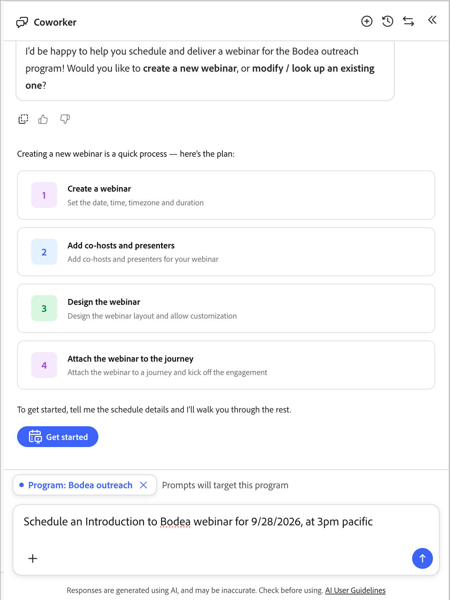
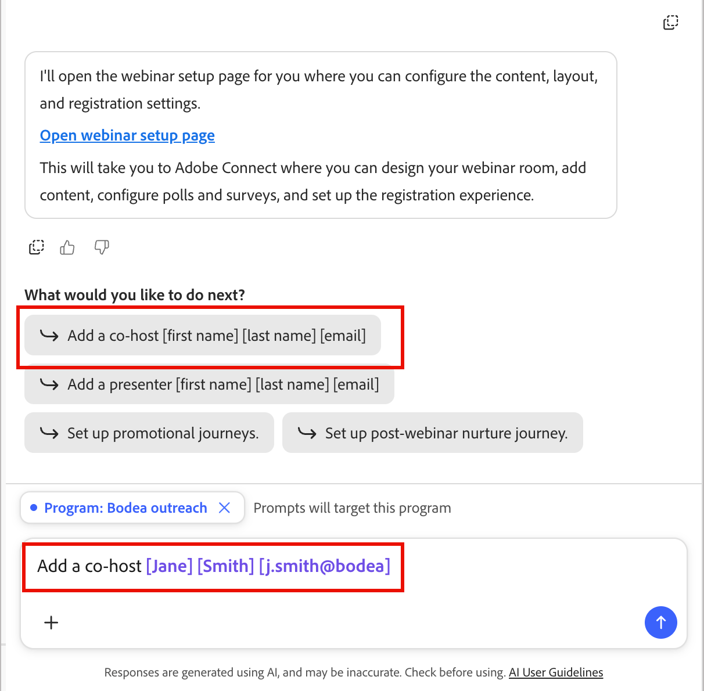

# 创建和推广网络研讨会

[聊天界面](./chat-interface.md)可以从网络研讨会创建到促销、投放、网络研讨会后培养和报告 — 完全通过对话窗格。 聊天界面构建的所有内容都使用[交互式网络研讨会概述](../marketing/webinars-overview.md)中描述的相同网络研讨会资产、历程和令牌，因此您可以随时在聊天界面和设计界面之间移动。

## 入口点

从“欢迎使用营销管理”问候语中，选择&#x200B;**[!UICONTROL 网络研讨会]**&#x200B;类别芯片以查看建议的提示，包括：

* *“计划和交付网络研讨会”*
* *“显示我所有即将召开的网络研讨会”*
* *“提供网络研讨会的详细信息[网络研讨会名称]”*

{width="700" zoomable="yes"}

当您从程序内部打开聊天窗格时，它会自动将提示限定为该程序。

## 添加已安排的网络研讨会 {#add-webinar}

在单个消息中描述您想要的网络研讨会，例如：

*“为[计划]于2026年10月12日下午4点（美国/洛杉矶）举办名为‘网络安全101：保护您的数据免受现代威胁’的交互式网络研讨会。”*

1. 聊天窗格显示&#x200B;**任务计划**&#x200B;核对清单并通过它工作：解析程序，设置名称、开始时间、结束时间、时区和容量，然后确认。

   {width="500" zoomable="yes"}

1. 聊天窗格列出您可用的网络研讨会&#x200B;**许可证**（例如，具有容量值的高容量附加产品），并询问要使用哪个产品。 回复您需要的容量，例如&#x200B;*“使用1000的网络研讨会容量。”*

   {width="500" zoomable="yes"}

1. 聊天窗格回荡节目、名称、开始时间、时区、持续时间和容量，并在创建网络研讨会之前要求您&#x200B;**确认**。

1. 创建网络研讨会后，聊天界面会显示&#x200B;**网络研讨会信息卡**，其中包含开始和结束时间、持续时间、主机、容量、提供商(Adobe Connect)、设置URL、启动URL、参与仪表板链接以及创建元数据。

1. 然后，聊天界面提供&#x200B;**次最佳操作**： _设计您的网络研讨会_、_添加联合主机_、_添加演示者_、_设置促销历程_&#x200B;和&#x200B;_设置网络研讨会后培训历程_。

   {width="500" zoomable="yes"}

### 添加联合主机和演示者 {#co-hosts-presenters}

从次佳操作中选择&#x200B;**[!UICONTROL 添加联合主机]**&#x200B;或&#x200B;**[!UICONTROL 添加演示者]**，或直接询问，例如&#x200B;*“添加联合主机[名字] [姓氏] [电子邮件]。”* 聊天界面会打开设计器中使用的相同添加对话框 — 输入姓名和电子邮件，因为每个人的添加方式当前都相同，而不是从名册选择器中选择。 添加人员后，将显示确认。

{width="500" zoomable="yes"}

### 设计网络研讨会

选择&#x200B;**[!UICONTROL 设计您的网络研讨会]**&#x200B;以打开网络研讨会设置页面，您可以在其中配置内嵌[!DNL Adobe Connect]设计表面中的内容、布局和注册设置。 在该界面中完成任何设计变更；聊天界面将您在那里链接，而不是在聊天中设计房间。 请参阅[设计网络研讨会](../marketing/create-webinar.md#create-and-design-a-webinar)。

{width="500" zoomable="yes"}

## 创建提升历程

1. 要求聊天界面设置促销历程。

   它会要求您选择模板并命名历程，例如&#x200B;*“邀请/注册历程”*。

1. 聊天界面创建历程并将电子邮件链接到其节点，从而构建包含网络研讨会成员状态更新的邀请和提醒流程。

1. 聊天界面列出了要在历程画布中配置的剩余内容。

1. 单击&#x200B;**[!UICONTROL 编辑历程节点]**&#x200B;并响应有关完成历程所需内容的查询。

   您可以上传促销活动文档以提供详细信息，也可以继续聊天以确定所需的内容。

   或者，您可以直接在历程画布中处理每个节点的地址：

   * 选择第一个历程节点并设置历程受众。 [了解详情](../marketing/person-audience-node.md)
   * 选择邀请&#x200B;_发送电子邮件_&#x200B;节点，然后单击&#x200B;**[!UICONTROL 编辑电子邮件]**。 [了解详情](../marketing/email-channel.md)
   * 选择“侦听事件”节点，然后单击&#x200B;**[!UICONTROL 编辑事件]**。 在&#x200B;_填写表单_&#x200B;事件上设置注册表单的事件筛选器。 [了解详情](../marketing/listen-for-event-nodes.md#event-filters)
   * 验证每个状态更改节点上的&#x200B;**[!UICONTROL 更改网络研讨会成员状态]**&#x200B;字段。 [了解详情](../marketing/action-nodes.md#actions-and-constraints)

1. 完成其他节点和地址的配置

1. 完成后，单击&#x200B;**[!UICONTROL 立即发布]**&#x200B;以启用历程并开始提升。

## 创建网络研讨会后历程

1. 咨询聊天界面以获得网络研讨会后历程。

   它会提示您输入模板和名称。

1. 聊天界面使用定义的路径和操作创建&#x200B;**拆分路径**&#x200B;节点：

   * **_已参加_**&#x200B;分支（例如，回复和资源&#x200B;_发送电子邮件_&#x200B;节点）
   * **_不显示_**&#x200B;分支(例如，“错过它？ 重新观看“_发送电子邮件_&#x200B;节点)

   每个节点后面都有一个&#x200B;_等待_&#x200B;和一个跟进&#x200B;_发送电子邮件_&#x200B;节点。

   拆分条件设置为使用&#x200B;_已参加网络研讨会_&#x200B;识别网络研讨会状态。

1. 单击&#x200B;**[!UICONTROL 编辑历程节点]**&#x200B;并响应有关完成历程所需内容的查询。

   您可以上传促销活动文档以提供详细信息，也可以继续聊天以确定所需的内容。

   或者，您可以直接在历程画布中处理每个节点的地址。

1. 完成其他节点和地址的配置

1. 完成后，单击&#x200B;**[!UICONTROL 立即发布]**&#x200B;以使历程处于活动状态并开始跟进。

## 检查报告

在聊天界面中，您可以询问报告问题，如&#x200B;*“显示我所有即将召开的网络研讨会”*&#x200B;或&#x200B;*“提供网络研讨会的详细信息[名称]”*。 它会显示参与仪表板链接以及次优操作，如&#x200B;**设计**、**添加联合主机**&#x200B;或&#x200B;**在网络研讨会日期**&#x200B;发布。

为了提供更深入的分析（出席情况、投票和调查表现以及每位成员的数据），聊天界面链接到网络研讨会的&#x200B;**Analytics**&#x200B;和&#x200B;**成员**&#x200B;选项卡，以及&#x200B;**网络研讨会管理**&#x200B;中的跨项目汇总。<!-- See [Webinar reporting](https://experienceleague.adobe.com/en/docs/journey-optimizer-b2b/prime/marketing-management/webinars/webinar-reporting). -->
