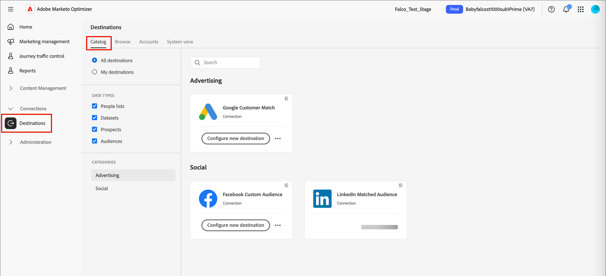

# 目标

目标是预建的集成，可让您将[静态人员列表](./people-lists.md#static-lists)从[!DNL Marketo Optimizer]发送到外部广告或社交平台，如LinkedIn促销活动受众、Google客户匹配受众或Facebook自定义受众。 将静态列表激活到目标可以保持成员资格同步：当在列表中添加人员或从列表中删除人员时，相应地，目标受众会添加人员，或者从受众馈送的任何营销活动中删除人员。

可通过两种方式将人员激活到连接的目标：

* **从静态列表** — 直接从&#x200B;**_[!UICONTROL 人员列表]_**&#x200B;选项卡激活现有的静态列表。 请参阅[激活到目标](./people-lists.md#static-list-activate)。
* **从人员历程** — 将&#x200B;**_[!UICONTROL 激活到目标]_**&#x200B;操作添加到历程路径，以便将到达该节点的任何人添加到列表并发送到目标。 请参阅&#x200B;[_添加操作节点_](../marketing/action-nodes.md#add-an-action-node)。

>[!BEGINSHADEBOX]

## 所需的权限 {#required-permissions}

完整目标功能需要启用以下[!DNL Adobe Experience Platform]权限。

| 类别 | 权限 | 必填 |
|--- |--- |--- |
| 沙盒 | 沙盒访问&#x200B;_（默认启用）_ | 是 |
| 仪表板 | 查看标准仪表板 | 是 |
| 仪表板 | 管理标准仪表板 | 是 |
| 目标 | 查看目标 | 是 |
| 目标 | 管理目标 | 是 |
| 目标 | 激活目标 | 是 |
| 目标 | 激活没有映射的区段 | 是 |
| 目标 | 管理和激活数据集目标 | 是 |
| 目标 | 目标创作 | 是 |
| 数据监管 | 查看数据使用策略 | 是 |
| 数据监管 | 管理数据使用策略 | 是 |
| 数据引入 | 查看源 | 是 |
| 数据引入 | 管理源 | 是 |
| 轮廓管理 | 查看配置文件设置 | 是 |
| 轮廓管理 | 管理配置文件设置 | 是 |

>[!ENDSHADEBOX]

## 支持的目标 {#supported-destinations}

在激活静态列表之前，目标必须存在于目标目录中。 在左侧导航中，展开&#x200B;**[!UICONTROL 连接]**&#x200B;并选择&#x200B;**[!UICONTROL 目标]**。 [!DNL Marketo Optimizer]当前支持以下目标：

* **[!UICONTROL Google客户匹配]** (Advertising)
* **[!UICONTROL Facebook自定义受众]** （社交）
* **[!UICONTROL LinkedIn匹配的受众]** (Social)

{width="800" zoomable="yes"}

>[!NOTE]
>
>此目录不是完整的[!DNL Adobe Experience Platform]目标目录。 如果您直接从[!DNL Experience Platform]访问目标，则会看到更大的目录，但目前在[!DNL Marketo Optimizer]中只能激活这些目标。 计划在未来版本中使用其他目标。

## 设置目标 {#set-up-destination}

每个受支持的目标卡都显示&#x200B;**[!UICONTROL 配置新目标]**。 配置目标是激活的先决条件。

1. 在连接器卡中，单击&#x200B;**[!UICONTROL 配置新目标]**。

1. 选择&#x200B;**[!UICONTROL 现有帐户]**&#x200B;或&#x200B;**[!UICONTROL 新帐户]**&#x200B;并输入帐户详细信息，如帐户名称和描述。

   {width="500"}

1. 单击&#x200B;**[!UICONTROL 连接到目标]**。

   OAuth流允许您登录到相应的帐户：LinkedIn、Google或Facebook。

   >[!IMPORTANT]
   >
   >此时，**不**&#x200B;输入&#x200B;_[!UICONTROL 目标详细信息]_。 只需要连接。

1. 完成人员属性和目标所需的字段之间的任何必填字段映射。

1. 查看数据治理和营销操作设置，然后单击&#x200B;**[!UICONTROL 保存]**。

有关完整设置步骤，请参阅[!DNL Experience Platform]文档中的[新建目标连接](https://experienceleague.adobe.com/zh-hans/docs/experience-platform/destinations/ui/connect-destination){target="_blank"}。

配置后，目标可用于在[!DNL Marketo Optimizer]中选择目标的任意位置进行激活。

## 激活和同步 {#activation-sync}

激活由静态列表成员资格驱动，列表和目标受众之间双向同步：

* 将人员添加到静态列表会在24小时内将它们激活到目标，并将它们添加到目标受众，随后添加到受众馈送的任何营销活动。
* 从静态列表中删除人员会将其从目标中停用 — 会将其从目标受众和任何连接的营销活动中删除。
* 可以将同一列表同时激活到多个目标；成员资格同步到所有这些目标。

>[!TIP]
>
>要针对区段运行LinkedIn营销活动，请激活这些人员的静态列表以将其添加到LinkedIn匹配的受众目标。 列表中的所有人都会添加到LinkedIn中的匹配受众，营销活动可以在其中定位他们，并且受众会在列表发生更改时自动保持最新状态。
