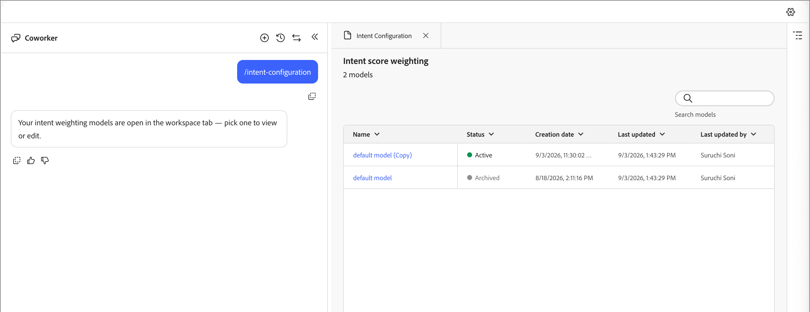

# 目的配置

单个标准化活动权重集不适用于客户。 真正购买意图的标志因企业而异。 配置并激活意图模型以指定对您而言重要的内容，例如，表单填写是否表示电子邮件点击以上，而不是继承一个全局默认值。

**[!UICONTROL 意图配置]**&#x200B;面板工具控制每个潜在客户意图活动计入人员意图得分的数量。 它是意图评分中唯一可配置的输入。 其他因素（如内容相关性、衰减和阈值）由系统管理。 它通过[意图配置技能](../agents/intent.md#configure-model)提供。

使用协同工作[聊天界面](../agents/chat-interface.md)的两种方法之一打开面板：

* 输入`/intent-configuration`命令。
* 单击&#x200B;**[!UICONTROL +]**，选择&#x200B;**[!UICONTROL 使用代理技能]**，选择&#x200B;**[!UICONTROL 意图]**&#x200B;选项卡，然后单击&#x200B;**[!UICONTROL 意图配置]**。

{width="700" zoomable="yes"}

## 模型列表视图

登录面板后显示&#x200B;**[!UICONTROL 意图得分权重]**，模型总数位于标题下方，包含按名称过滤的搜索字段和可排序的表：

| 列 | 注释 |
| --- | --- |
| [!UICONTROL 名称] | 可排序，默认排序 |
| [!UICONTROL 状态] | _[!UICONTROL 活动]_ （绿色点），_[!UICONTROL 草稿]_ （橙色点），_[!UICONTROL 已存档]_ （灰色点） |
| [!UICONTROL 创建日期] | 缩写，悬停时的完整日期 |
| [!UICONTROL 上次更新时间] | 缩写，悬停时的完整日期 |
| [!UICONTROL 上次更新者] | 截断用户名，悬停时显示全名 |

任何时候只有一个模型可以是&#x200B;_[!UICONTROL 活动]_，并且它是推动评分的模型。 其他所有模型都处于&#x200B;_[!UICONTROL 草稿]_（正在编辑，尚未启用）或&#x200B;_[!UICONTROL 已存档]_（以前的&#x200B;_[!UICONTROL 活动]_&#x200B;模型，激活新模型时自动降级）状态。

单击一行以打开模型详细信息视图。

## 模型详细信息视图

详细信息视图显示模型名称、状态徽章、上次保存的时间戳和痕迹导航，其中显示&#x200B;**[!UICONTROL 意图得分权重]**&#x200B;和模型名称，单击它们可返回到列表。

详细信息视图将列出采购员意图活动，以及每个活动对人员意图得分的重要性级别。 活动目录是固定的，只有级别才能更改。 这些级别是独立的：它们不需要合计任何总计。 一次只能激活一个版本的加权模型。 要进行更改，请复制当前版本并编辑副本。

{width="550" zoomable="yes"}

搜索字段按名称筛选活动行。 表本身：

| [!UICONTROL 意图活动] | [!UICONTROL 人工智能建议] | [!UICONTROL 权重] | [!UICONTROL 重置] |
| --- | --- | --- | --- |
| 例如， Add to Opportunity 、 Fill Form 、 Click Email 、 Click Link 、 Open Email 、 Unsubscribe Email 、 Visit Web页面、 Query questions in webinar 、 Asset downloads in webinar 、 Interesting Moment 、 Responding Poll in Webinar 、 Update Opportunity | 只读 | 下拉列表，可在绘制模型上编辑 | **↺**&#x200B;图标：将此行重置为AI建议值 |

**加权层**（AI建议列和加权列的比例相同）：

| 层 | 值 |
| ---| --- |
| [!UICONTROL 无权重] | 0 |
| [!UICONTROL 普通] | 30 |
| [!UICONTROL 次要] | 40 |
| [!UICONTROL 正常] | 60 |
| [!UICONTROL 重要] | 90 |
| [!UICONTROL 重要] | 100 |

{width="550" zoomable="yes"}

将活动设置为&#x200B;**[!UICONTROL 无权重]** (0)会使其完全失去评分。 默认情况下，系统使用此方法时不包括&#x200B;**[!UICONTROL 取消订阅电子邮件]**。

单击表上方的&#x200B;**[!UICONTROL 全部重置为建议]**&#x200B;以将每一行恢复为其AI建议值。

### 创建和激活模型

要创建和激活新的加权模型，请执行以下步骤。

1. 从现有&#x200B;_[!UICONTROL 草稿]_&#x200B;模型开始。

   您还可以单击当前&#x200B;_[!UICONTROL 活动]_&#x200B;模型的&#x200B;**[!UICONTROL 复制]**&#x200B;以将其权重克隆到新草稿中。

1. 逐行调整权重，以反映对您的业务最重要的内容。

   例如，将低信号活动降级为&#x200B;**[!UICONTROL Trivial]**，或者将高信号活动升级为&#x200B;**[!UICONTROL Important]**&#x200B;或&#x200B;**[!UICONTROL Vital]**。

1. 单击&#x200B;**[!UICONTROL 保存]**。

   保存会提示您立即激活模型。

1. 确认激活。

确认使其成为新的&#x200B;_[!UICONTROL 活动]_&#x200B;模型，并自动将以前活动的模型降级为&#x200B;_[!UICONTROL 已存档]_。 一次只能有一个模型处于活动状态。

### AI建议列

人工智能建议列是一个起点，而不是经过训练的建议。

* 一个LLM完成调用一次处理租户的所有活动，而不是每个活动一个调用。

* 对于每个活动，模型只读取其名称和描述，然后根据B2B购买者行为的一般知识选择一个权重层。 例如，考虑&#x200B;**[!UICONTROL 填写表单]**&#x200B;或&#x200B;**[!UICONTROL 单击电子邮件]**&#x200B;通常是B2B购买者的信号。 它无法访问租户的客户数据、CRM记录或历史参与模式，并且当前不是特定于租户或订阅的。

* 在创建模型时，输出会在`IBG_INTENT_ACTIVITY_WEIGHT`中填充`SUGGESTED_WEIGHT_VALUE`，并在之后保持静态。 在编辑“权重”列时，它不会更新。

* 每个活动行始终都有一个已填充的建议值。 没有保留为空。

审核并调整每一行以反映您自己的业务环境。 建议值是合理的缺省值，而不是调谐模型。

## 针对模型的操作

您可以根据模型的状态来管理模型。

| 操作 | 可用于 | 发生什么情况 |
| --- | --- | --- |
| **[!UICONTROL 重复]** | 有效，草稿 | 打开标题为&#x200B;**[!UICONTROL 重复]**&#x200B;的模式，其中已预填充名称字段和&#x200B;**[!UICONTROL 取消]**&#x200B;和&#x200B;**[!UICONTROL 重复]**&#x200B;按钮。 确认将创建具有相同权重的新&#x200B;_[!UICONTROL 草稿]_&#x200B;模型，该模型将直接在详细信息视图中打开。 |
| **[!UICONTROL 激活]** | 仅草稿（在保存后也作为提示提供） | 将草稿提升为&#x200B;_[!UICONTROL 活动]_，并将以前活动的模型自动降级为&#x200B;_[!UICONTROL 已存档]_。 |
| **[!UICONTROL 删除]** | 仅草稿 | 在永久删除之前提示确认对话框。 此操作不可逆。 无法删除活动模型。 |

由于只有草稿模型可编辑，因此正常的工作流程是单击当前&#x200B;_[!UICONTROL 活动]_&#x200B;模型的&#x200B;**[!UICONTROL 复制]**，调整草稿副本的权重，然后单击&#x200B;**[!UICONTROL 保存]**。 您可以使用&#x200B;**[!UICONTROL 激活]**&#x200B;按钮立即或稍后激活它。

## 在意图得分中加权计算

**[!UICONTROL 权重]**&#x200B;列显示每日评分中使用的数字，从当前&#x200B;_[!UICONTROL 活动]_&#x200B;模型的行中读取。 潜在客户意图得分的三个驱动因素：

1. **此处为每个活动配置的权重** (`WEIGHT_VALUE`)。 它从AI建议开始，但可以按租户覆盖。 仅使用与&#x200B;_[!UICONTROL Active]_&#x200B;模型关联的行，因此权重更改不需要代码释放。

1. **内容相关性**：无法在此处配置。 系统从与活动相关的内容或资产中提取关键字，并从0到1对内容与关键字、产品或类别的匹配程度进行评分。

1. **频率**：潜在客户与该内容交互的次数，已计入人员参与的平均值。

从形式上讲，每个参与度`activity weight × content relevance`平均为&#x200B;**每日得分**，应用了&#x200B;**7天的指数衰减**，因此最近的活动占主导地位，然后将当前群体中的最小最大值标准化为0至1，并分段统计：

| 最终得分 | 意图级别 |
| --- | --- |
| > 0.6 | 高 |
| > 0.2 | 媒介 |
| 否则 | 低 |

### 内容相关性

对于基于Web的活动，系统会检查资产URL和关联公司，然后从该公司的分类法中派生相关关键字。 例如，绑定到[!DNL Intuit]的URL将显示关键字，如&#x200B;_tax_&#x200B;或&#x200B;_payroll_。 潜在客户对该内容的实际参与度（例如，查看[!DNL TurboTax]页面或[!DNL QuickBooks]页面）与这些关键字进行比较，以确定兴趣映射到的特定产品。 对于非Web活动（如&#x200B;_[!UICONTROL 有趣的时刻]_）（包括离线事件），模型会评估该时刻的描述或内容（如离线网络研讨会主题），而不是活动类型。 内容（而非事件类别）决定了相关性。

## 已知限制

以下限制适用于当前的目的配置。

* **今天没有自定义或租户定义的活动。** 活动目录已修复，[!DNL Marketo Engage]是唯一的真实来源。 活动必须登录[!DNL Marketo Engage]才能评分。 正在限定租户定义活动的未来列的范围。
* **今天没有第三方意图引入**，例如，来自[!DNL Demandbase]、[!DNL ZoomInfo]或[!DNL 6sense]。 计划对以后的版本进行此更新。 在此之前，解决方法是在第三方工具中构建受众，并将其直接推送到[!DNL Marketo Engage]或[!DNL Marketo Optimizer]中，而不考虑对该信号的意图评分。
* **没有来自加权面板或意图报表的本机导出**。 查看[报告跟进](../agents/intent.md#report-follow-up)以将报告结果转换为人员列表的提示。
