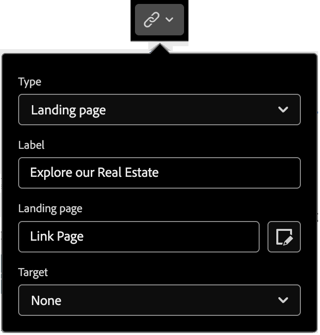
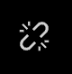
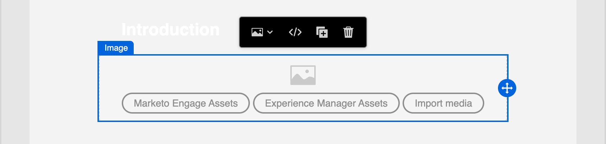

# 内容组件 {#content-components}

>[!CONTEXTUALHELP]
>id="ajo-b2b-prime_content_components_email"
>title="关于内容组件"
>abstract="内容组件是空的内容占位符，可用于设计电子邮件。"

>[!CONTEXTUALHELP]
>id="ajo-b2b-prime_content_components_landing_page"
>title="关于内容组件"
>abstract="内容组件是空的内容占位符，可用于设计登陆页面。"

>[!CONTEXTUALHELP]
>id="ajo-b2b-prime_content_components_fragment"
>title="关于内容组件"
>abstract="内容组件是空的内容占位符，可用于设计片段。"

>[!CONTEXTUALHELP]
>id="ajo-b2b-prime_content_components_template"
>title="关于内容组件"
>abstract="内容组件是空的内容占位符，可用于设计模板。"

设计电子邮件、登陆页、模板和可视化片段的内容时，请使用[!UICONTROL 内容组件]添加可视化设计元素。

您可以在一个或多个[结构组件](./structure-components.md)中添加所需数量的内容组件，这些组件定义布局。

## 内容库

组件库的&#x200B;**[!UICONTROL Contents]**&#x200B;部分显示可用的内容组件：

| 图标 | 组件 | 描述 |
| --------- | ---- | ----------- |
|  | [容器](#container) | 将此组件添加到您的设计中可包括一个矩形容器，您可以使用该容器对组件进行分组或向区域应用背景或边框样式。 |
|  | [按钮](#button) | 将此组件添加到您的设计以包含一个可单击的按钮元素。 |
|  | [文本](#text) | 将此组件添加到您的设计以包含文本正文。 |
|  | [分隔线](#divider) | 将此组件添加到您的设计中以包含水平线来分隔内容的各个区域。 |
|  | [HTML](#html) | 将此组件添加到您的设计以复制并粘贴现有HTML的各个部分。 使用此组件可创建免费的模块化HTML块以重用某些外部内容。 |
|  | [图像](#image) | 将此组件添加到您的设计以插入图像文件。 |
|  | [社交](#social) | 将此组件添加到您的设计以插入指向社交媒体页面的链接。 |
|  | [表单](#form) | **_仅适用于登陆页面。_** 将此组件添加到您的设计以插入已创建的表单。 |

## 内容组件工具栏

在画布中选择每个内容组件类型后，都会显示一个工具栏。 可用的工具因组件类型而异，它们提供了一种在渲染的内容中直接使用组件的简单方法。 工具栏包含适用于组件类型的格式设置和功能功能。

{width="450"}

### 格式化工具

+++更改文本样式

<table>
    <tr>
        <th style="width: 30%;">工具</th>
        <th style="width: 50%;">使用情况</th>
        <th style="width: 20%;">组件</th>
    </tr>
    <tr>
        <td></td>
        <td>将粗体、斜体、下划线、删除线、上标或下标应用于所选文本字符串。</td>
        <td><li>按钮 <li>文本</td>
    </tr>
</table>

+++

+++水平对齐方式

<table>
    <tr>
        <th style="width: 30%;">工具</th>
        <th style="width: 50%;">使用情况</th>
        <th style="width: 20%;">组件</th>
    </tr>
    <tr>
        <td></td>
        <td>对组件内容应用水平对齐类型。 选择“左”、“居中”、“右”或“对齐”。 </td>
        <td><li>按钮 <li>文本</td>
    </tr>
</table>

+++

+++创建列表

<table>
    <tr>
        <th style="width: 30%;">工具</th>
        <th style="width: 50%;">使用情况</th>
        <th style="width: 20%;">组件</th>
    </tr>
    <tr>
        <td></td>
        <td>对组件文本应用排序或未排序列表格式。</td>
        <td><li>文本</td>
    </tr>
</table>

+++

+++设置标题

<table>
    <tr>
        <th style="width: 20%;">工具</th>
        <th style="width: 60%;">使用情况</th>
        <th style="width: 20%;">组件</th>
    </tr>
    <tr>
        <td></td>
        <td>将标题级别格式应用到光标位置的段落。</td>
        <td><li>按钮 <li>文本</td>
    </tr>
</table>

+++

+++字体大小

<table>
    <tr>
        <th style="width: 20%;">工具</th>
        <th style="width: 60%;">使用情况</th>
        <th style="width: 20%;">组件</th>
    </tr>
    <tr>
        <td></td>
        <td>将字体大小应用到所选文本。 单击该工具，然后选择尺寸或输入像素值。</td>
        <td><li>按钮 <li>文本</td>
    </tr>
</table>

+++

+++字体颜色

<table>
    <tr>
        <th style="width: 40%;">工具</th>
        <th style="width: 40%;">使用情况</th>
        <th style="width: 20%;">组件</th>
    </tr>
    <tr>
        <td></td>
        <td>将字体颜色应用于所选文本。 从选取器中选择一种颜色，然后使用颜色滑块和颜色字段来选择颜色。 或者，您可以输入已知的RGB、HSL、HSB或十六进制值。 </td>
        <td><li>按钮 <li>文本</td>
    </tr>
</table>

+++

+++插入链接

<table>
    <tr>
        <th style="width: 40%;">工具</th>
        <th style="width: 40%;">使用情况</th>
        <th style="width: 20%;">组件</th>
    </tr>
    <tr>
        <td></td>
        <td>为所选文本或元素创建可单击链接。 <li>电子邮件内容 — 指定外部URL或登陆页面。<li>登陆页面内容 — 指定外部链接。</td>
        <td><li>按钮 <li>文本 <li>图像 </td>
    </tr>
</table>

+++

+++删除链接

<table>
    <tr>
        <th style="width: 15%;">工具</th>
        <th style="width: 60%;">使用情况</th>
        <th style="width: 25%;">组件</th>
    </tr>
    <tr>
        <td></td>
        <td> 删除所选文本或元素的可单击链接。</td>
        <td><li>按钮 <li>文本 <li>图像 </td>
    </tr>
</table>

+++

### 功能工具

| 工具 | 名称 | 使用情况 |
| ---- | ---- | ----- |
| {width="40"} | 添加个性化 | 使用个性化编辑器在组件内容中插入个性化令牌。 [了解详情](./email-authoring.md#personalize-content) |
| {width="40"} | 显示源代码 | 在只读弹出窗口中显示组件的HTML源代码。  {width="200"} |
| {width="40"} | 启用条件内容 | （电子邮件和片段）为组件启用条件变体。 |
| {width="40"} | 重复 | 创建组件的副本并直接将其添加到下方。 |
| {width="40"} | 删除 | 删除组件。 |

## 将内容组件添加到您的设计

1. 在可视设计空间中，使用现有模板或将所需的结构组件添加到空画布中以定义布局。

1. 在&#x200B;**[!UICONTROL 组件]**&#x200B;库中，获取所选内容组件的&#x200B;_拖动手柄_ ，然后将其拖放到结构组件上。

   您可以将多个组件添加到单个结构组件中，也可以将它们添加到结构组件的每一列中。

   {width="600" zoomable="yes"}

1. 使用右侧的&#x200B;**[!UICONTROL 设置]**&#x200B;和&#x200B;**[!UICONTROL 样式]**&#x200B;选项卡或画布中显示的上下文工具栏调整组件显示。

   例如，可以更改组件的文本样式、填充或边距。

   {width="600" zoomable="yes"}

在处理设计时，您还可以使用[功能工具](#functional-tools)部分中的&#x200B;**删除**&#x200B;和&#x200B;**复制**&#x200B;工具删除或复制组件。

## 内容组件设置和样式

添加组件后，将在可视设计空间中选择该组件，其属性将显示在右侧面板中。 您还可以随时选择组件以更改设置和样式。 许多设置和样式都是特定于组件的，但有一些标准设置和样式可应用到任何选定内容组件。

### 显示选项

如果要从桌面或移动设备显示中排除该组件，请更改&#x200B;**[!UICONTROL 显示选项]**&#x200B;设置。 默认值&#x200B;_[!UICONTROL 在所有设备上显示]_，允许在所有设备上显示。 选择其他设置以使组件按设备类型专用：

* _[!UICONTROL 仅在桌面设备上显示]_ — 当您想要在桌面设备上显示组件并为移动设备排除该组件时，请选择此设置。
* _[!UICONTROL 仅在移动设备上显示]_ — 如果要在移动设备（如手机和平板电脑）上显示组件，请选择此设置，并将其排除在桌面设备之外。

{width="400" zoomable="yes"}

### 容器 {#container}

使用容器将特定样式应用于一组内容组件。 添加[!UICONTROL Container]组件，然后在其内部添加其他内容组件。 此组件类似于您在HTML中使用`div`元素的方式。 您可以对容器应用不同的样式，使其不同于对容器所包含的内容组件应用的样式。

例如，添加一个&#x200B;_[!UICONTROL 容器]_&#x200B;组件，然后在该容器中添加一个&#x200B;_[!UICONTROL 按钮]_&#x200B;组件。 您可以为容器使用特定区域样式，并根据需要为按钮及其背景设置样式。

{width="600" zoomable="yes"}

+++背景

{{styles-background}}

+++

+++边框

{{styles-border}}

+++

+++大小

{{styles-size}}

+++

+++边距

{{styles-margin}}

+++

+++填充

{{styles-padding}}

+++

### 按钮 {#button}

使用[!UICONTROL Button]组件在内容中插入一个或多个可单击按钮。 使用按钮将页面查看者或电子邮件收件人重定向到支持内容（已发布的登陆页面或外部链接）。

#### 添加按钮文本

在画布中显示按钮组件时，工具栏包含文本格式设置选项以及个性化和条件变体。 有关编辑器工具栏选项的详细信息，请参阅[内容组件工具栏](#content-component-toolbars)。

在输入按钮标签文本并设置格式时，按钮会调整大小以适应内容。

与工具栏一起显示的{width="500" zoomable="yes"}

#### 设置链接选项 {#button-set-link-options}

在&#x200B;_[!UICONTROL 设置]_&#x200B;选项卡上，使用&#x200B;**[!UICONTROL 链接]**&#x200B;选项定义按钮文本、链接目标以及用于加载目标页面的浏览器行为。

1. 为链接设置&#x200B;**[!UICONTROL 类型]**：

   * **[!UICONTROL 外部链接]** — 选择此类型以使用标准URL作为链接目标。

     在&#x200B;**[!UICONTROL Url]**&#x200B;中，输入链接目标的URL。 单击&#x200B;_个性化_ （ ）图标，将个性化令牌用作URL中的参数。

     {width="200"}

   * **登陆页面** — 选择此类型可在<!-- Journey Optimizer B2B Edition (_Beta_) or -->连接的Marketo Engage实例中选择已发布的登陆页面。

     对于&#x200B;**[!UICONTROL 登陆页面]**&#x200B;选项，选择已发布的登陆页面。 单击&#x200B;_选择页面_&#x200B;图标（）和[选择已发布的登陆页面](./landing-pages.md#link-to-landing-page)。

     {width="200"}

1. 对于&#x200B;**[!UICONTROL 标签]**，输入要显示在按钮中的文本。

   按钮大小会根据您设置的文本和样式进行调整。

1. 对于&#x200B;**[!UICONTROL Target]**，请选择如何从电子邮件或页面重定向链接的目标：

   * _[!UICONTROL 无]_ — 使用默认浏览器或客户端行为（默认）打开链接。
   * _[!UICONTROL 空白]_ — 在新窗口或选项卡中打开链接。
   * _[!UICONTROL Self]_ — 在同一帧中打开链接。
   * _[!UICONTROL 父项]_ — 在父框架中打开链接。
   * _[!UICONTROL Top]_ — 在窗口的整个正文中打开链接。

#### 设置样式

在&#x200B;**[!UICONTROL 样式]**&#x200B;选项卡中自定义按钮样式。

+++背景

{{styles-background}}

+++

+++文本

{{styles-text}}

+++

+++边框

{{styles-border}}

+++

+++大小

{{styles-size}}

+++

+++对齐方式

{{styles-alignment-h-v}}

+++

+++按钮边距

{{styles-margin}}

+++

+++容器边距

{{styles-margin}}

+++

+++填充

{{styles-padding}}

+++

+++高级

{{styles-advanced}}

+++

### 文本 {#text}

使用文本组件在内容中插入文本块。 在画布中选择文本组件后，输入文本并使用工具栏选项添加内联格式和选项，包括个性化令牌和条件变体。

在&#x200B;**[!UICONTROL 样式]**&#x200B;选项卡中自定义文本组件样式。

+++背景

{{styles-background}}

+++

+++文本

这些样式将应用于整个文本块。 可以将内联样式应用于所选文本字符串。

{{styles-text}}

+++

+++边框

{{styles-border}}

+++

+++大小

{{styles-size}}

+++

+++边距

{{styles-margin}}

+++

+++填充

{{styles-padding}}

+++

+++高级

{{styles-advanced}}

+++

### 分隔条 {#divider}

添加&#x200B;_分隔线_&#x200B;组件以在内容的不同部分之间合并线性分隔。

+++背景

{{styles-background}}

+++

+++线形图

在选择了&#x200B;_[!UICONTROL 样式]_&#x200B;选项卡的右侧面板上，展开&#x200B;**[!UICONTROL 行]**&#x200B;部分并设置组件高度和宽度的选项：

* **[!UICONTROL 颜色]** — 单击颜色正方形以从选取器中选择颜色。 您可以通过输入已知的RGB、HSL、HSB或十六进制值来选择颜色。 或者，可以使用颜色滑块和颜色域来选择颜色。

* **[!UICONTROL 高度]** — 单击向上和向下箭头图标以增加或减少像素数。 缺省值为空值(Auto)，并根据元素的内容调整元素的高度。

* **[!UICONTROL 宽度]** — 使用切换开关以像素或百分比设置宽度。

  * 对于百分比宽度，使用滑块设置百分比值。 百分比根据包含块的内容框确定元素大小，其中不包括填充和边框。 例如，如果值为50，则将元素宽度设置为其包含的块内容宽度的50%。

  {width="250"}

  * 对于基于像素的宽度，单击向上和向下箭头图标可增加或减少像素数。 缺省值为空值(Auto)，并根据元素的内容调整元素宽度。

* **[!UICONTROL 样式]** — 从标准CSS `line-style`值列表中选择一个值，如&#x200B;_实线_、_点线_&#x200B;和&#x200B;_虚线_。

+++

+++大小

{{styles-size}}

+++

+++对齐方式

{{styles-alignment-h}}

+++

+++边距

{{styles-margin}}

+++

+++填充

{{styles-padding}}

+++

+++高级

{{styles-advanced}}

+++

### HTML {#html}

使用HTML组件可添加部分现有HTML。 此组件提供了一种轻松创建可重复使用外部内容的模块化HTML元素的方法。

1. 在画布上选择组件，然后单击工具栏中的&#x200B;_显示源代码_&#x200B;图标。

   {width="450"}

1. 将HTML粘贴到文本框中，然后单击&#x200B;**[!UICONTROL 保存]**。

   {width="600" zoomable="yes"}

   如果HTML有效，它会在画布上呈现元素。 如果它是一个映射到其他内容组件的元素，则可以根据组件类型更改右侧面板中的设置和样式。 如果不包含，它仍会作为HTML组件存在。

对于HTML组件，您可以在右侧面板中为整个HTML组件设置以下样式：

+++背景

{{styles-background}}

+++

+++边框

{{styles-border}}

+++

+++大小

{{styles-size}}

+++

+++对齐方式

{{styles-alignment-h-v}}

+++

+++边距

{{styles-margin}}

+++

+++填充

{{styles-padding}}

+++

+++高级

{{styles-advanced}}

+++

### 图像 {#image}

使用[!UICONTROL 图像]组件将图像资源插入到您的内容中。 在画布中选择&#x200B;_图像_&#x200B;组件后，您可以添加或更改显示的图像资源文件。

{width="400" zoomable="yes"}

#### 添加图像资源 {#add-image-asset}

选择要添加图像资源的方法：

* **[!UICONTROL 选择资源]** — 选择此类型以浏览并从[!DNL Marketo Optimizer] Assets库中选择图像资源。

  {width="700" zoomable="yes"}

  从该对话框中，可以从所选存储库中选择图像。 单击&#x200B;**[!UICONTROL 选择]**&#x200B;以添加资产。

  有多种工具可帮助您找到所需的资源：

  * 单击左上角的&#x200B;_筛选器_&#x200B;图标以根据您的条件筛选显示的项目。

  * 在&#x200B;_搜索_&#x200B;字段中输入文本，以筛选显示的项目以匹配资源名称。

* **[!UICONTROL 导入媒体]** — 选择此类型可从系统中选择文件并将其导入[!DNL Marketo Optimizer]资源库。

  在&#x200B;_[!UICONTROL 上传图像]_&#x200B;对话框中，将文件从您的系统拖放到文件框中。 最大文件大小为100 MB。

  {width="450"}

  对话框中显示所选图像的文件名。 资源文件名必须是唯一的（跨文件夹），如果具有该名称的文件已存在，则会显示一条消息。 名称最多可包含100个字符，并且不能包含特殊字符（如`;`、`:`、`\`和`|`）。

  单击&#x200B;**[!UICONTROL 导入]**。

可以在右侧面板中为图像添加图像标题和替换文本。

{width="250"}

#### 设置链接选项 {#image-set-link-options}

在&#x200B;_[!UICONTROL 设置]_&#x200B;选项卡上，使用&#x200B;**[!UICONTROL 链接]**&#x200B;选项将图像链接到目标以及用于加载目标页面的浏览器行为。

1. 为链接设置&#x200B;**[!UICONTROL 类型]**：

   * **[!UICONTROL 外部链接]** — 选择此类型以使用标准URL作为链接目标。

     在&#x200B;**[!UICONTROL Url]**&#x200B;中，输入链接目标的URL。 单击&#x200B;_个性化_ （ ）图标，将个性化令牌用作URL中的参数。

     {width="250"}

   * **登陆页面** — 选择此类型可在<!-- Journey Optimizer B2B Edition (_Beta_) or -->连接的Marketo Engage实例中选择已发布的登陆页面。

     对于&#x200B;**[!UICONTROL 登陆页面]**&#x200B;选项，选择已发布的登陆页面。 单击&#x200B;_选择页面_&#x200B;图标（）和[选择已发布的登陆页面](./landing-pages.md#link-to-landing-page)。

     {width="250"}

1. 对于&#x200B;**[!UICONTROL 标签]**，可以选择为图像链接输入描述性文本。

1. 对于&#x200B;**[!UICONTROL Target]**，请选择如何从电子邮件或页面重定向链接的目标：

   * _[!UICONTROL 无]_ — 使用默认浏览器或客户端行为（默认）打开链接。
   * _[!UICONTROL 空白]_ — 在新窗口或选项卡中打开链接。
   * _[!UICONTROL Self]_ — 在同一帧中打开链接。
   * _[!UICONTROL 父项]_ — 在父框架中打开链接。
   * _[!UICONTROL Top]_ — 在窗口的整个正文中打开链接。

#### 设置样式

在右侧面板中设置图像组件的样式。

+++背景

{{styles-background}}

+++

+++边框

{{styles-border}}

+++

+++大小

{{styles-size}}

+++

+++对齐方式

{{styles-alignment-h}}

+++

+++边距

{{styles-margin}}

+++

+++填充

{{styles-padding}}

+++

+++高级

{{styles-advanced}}

+++

### 社交 {#social}

使用&#x200B;_Social_&#x200B;组件将指向社交媒体页面的链接插入到您的内容中。 它包含三种默认社交媒体类型，但您可以根据需要添加或删除这些类型。

{width="600" zoomable="yes"}

* 要添加社交媒体类型，请单击&#x200B;_添加_ ( **+** )图标，然后选择要添加的社交媒体类型。

  {width="250"}

* 要删除社交媒体类型，请单击社交媒体图标旁边的&#x200B;**X**。

展开每种社交媒体类型的卡以设置选项：

* **[!UICONTROL URL]** — 输入要链接到社交媒体图形或图标的社交媒体URL。
* **[!UICONTROL Source]** — 如果要使用自己的图像而不是默认图像，请选择图像资源。 您可以从Assets库中选择图像，或从系统中导入图像文件。 有关选择和导入图像资产的详细信息，请参阅[图像组件信息](#add-the-image-asset)。
* **[!UICONTROL 替代文本]** — 为显示的图像输入替代文本。

{width="250"}

若要为所有社交媒体图形定义一致的显示大小，请设置&#x200B;**[!UICONTROL 图像大小]**。

您可以为&#x200B;_Social_&#x200B;组件设置以下样式选项：

+++背景

{{styles-background}}

+++

+++边框

{{styles-border}}

+++

+++大小

{{styles-size}}

+++

+++对齐方式

{{styles-alignment-h}}

+++

+++边距

{{styles-margin}}

+++

+++填充

{{styles-padding}}

+++

+++高级

{{styles-advanced}}

+++

### 表单（仅限登陆页面） {#form}

使用&#x200B;_表单_&#x200B;组件将已发布的表单添加到登陆页面或登陆页面模板。 有关创建和发布表单的更多信息，请参阅[Forms](./forms.md)。

1. 单击组件工具栏中的&#x200B;_表单_&#x200B;工具，或使用右侧的&#x200B;**[!UICONTROL 嵌入表单]**&#x200B;属性选择发布的表单。

   {width="600"}

1. 如果要覆盖表单的默认&#x200B;**[!UICONTROL 跟进类型]**，请根据页面或模板的要求更改设置。

   此页面也称为表单的&#x200B;_感谢页面_，此设置确定访客提交表单时会发生什么情况：

   * **[!UICONTROL 停留在页面]** — 选择此选项可在提交表单时将访客停留在同一页面。

   * **[!UICONTROL 登陆页面]** — 选择此选项可选择任意[!DNL Marketo Optimizer]或Marketo Engage登陆页面作为跟进。

   * **[!UICONTROL 外部URL]** — 选择此选项可将任何URL指定为后续页面。 访客提交表单后，浏览器会加载指定的URL。

     >[!TIP]
     >
     >如果要使用表单下载文件，您可以为托管文件指定URL。 对于此配置，“提交”按钮可用作下载按钮。

     {width="280"}

如果需要，请选择右侧面板中的&#x200B;**[!UICONTROL 样式]**&#x200B;选项卡以设置结构组件中的表单边距。

{{styles-margin}}
