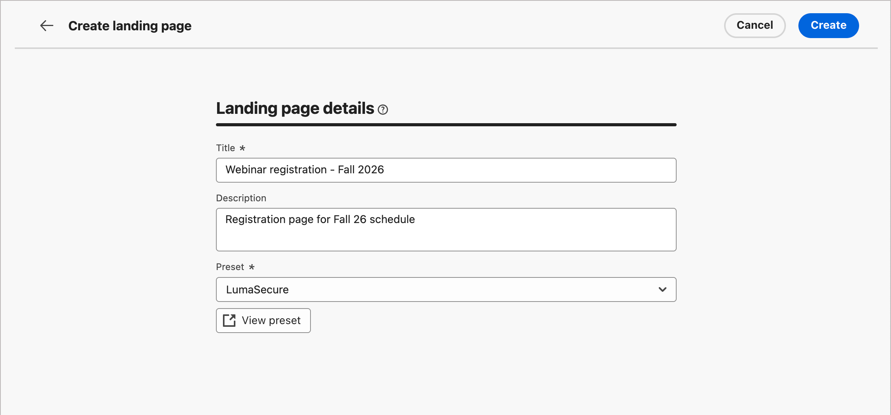

# 创建和发布登陆页面

作为营销人员，您可以定义并发布要合并到历程中的页面。 添加新登陆页面时，您可以配置主页面和任何子页面、设计内容、测试它并发布它。

>[!BEGINSHADEBOX]

## 登陆页面先决条件 {#landing-page-prerequisites}

在营销人员创建登陆页面以支持其历程之前，必须准备好以下配置和资产：

* [登陆页面子域](../admin/configuration-presets-landing-pages.md#lp-subdomains) — 设置专用于托管登陆页面的子域。
* [登陆页面预设](../admin/configuration-presets-landing-pages.md#lp-presets) — 预设定义了应用于登陆页面的子域和其他设置。
* [表单](./forms.md)（用于数据捕获用例） — 当您要在登陆页面上嵌入表单并将数据提交到Experience Platform时，此为必需字段。

>[!ENDSHADEBOX]

## 创建登陆页面 {#create-landing-page}

>[!CONTEXTUALHELP]
>id="ajo-b2b-prime_lp_create"
>title="定义和配置您的登陆页面"
>abstract="要创建登陆页面，您需要选择一个预设，然后配置主要页面和子页面，最后在发布之前测试您的页面。"

要在历程受众成员单击特定链接时将其定向到定义的网页，请在[!DNL Marketo Optimizer]中创建登陆页面。

>[!IMPORTANT]
>
>在创建第一个登陆页面之前，请完成登陆页面设置。 这包括配置子域以托管登陆页面，并定义至少一个指定子域和其他渠道设置的预设。 在创建登陆页面时选择预设。 有关管理员设置，请参阅[登陆页面配置](../admin/configuration-presets-landing-pages.md)。
>
>对于数据捕获用例，请先创建一个[表单](./forms.md)，然后再将其嵌入到登陆页面上。

创建登陆页面(_T):_

1. 转到左侧导航并选择&#x200B;**[!UICONTROL 内容管理]** > **[!UICONTROL 登陆页面]**。

1. 从登陆页面列表中，单击&#x200B;**[!UICONTROL 创建登陆页面]**。

1. 输入&#x200B;**[!UICONTROL Title]**（必需）和&#x200B;**[!UICONTROL Description]**（可选）。

   标题和描述条件：

   * **标题** — 最多100个字符。 必须唯一（不区分大小写）。
   * **描述** — 最多300个字符。
   * 允许使用Alpha、数字和特殊字符。
   * 保留字符为&#x200B;**_不允许_**： `\ / : * ? " < > |`

   {width="600"}

1. 选择&#x200B;**[!UICONTROL 预设]**。

   管理员[创建登陆页面预设](../admin/configuration-presets-landing-pages.md#lp-presets)以定义用于登陆页面的子域和其他设置。 选择一个预设，然后单击&#x200B;**[!UICONTROL 查看预设]**&#x200B;以查看其设置并确认它们符合您的登陆页面要求。

1. 单击&#x200B;**[!UICONTROL 创建]**。

   将显示主页面及其属性。 了解如何[配置主页面设置](#configure-primary-page)。

   {width="700" zoomable="yes"}

1. 要添加子页面（例如，感谢页面或错误页面），请单击&#x200B;**+**&#x200B;图标。

   每个登陆页面最多可添加两个子页面。

配置并设计主页面和任何子页面后，请在发布登陆页面](#test-landing-page)之前[对其进行测试。

>[!CAUTION]
>
>您不能通过复制定义的URL并将其粘贴到Web浏览器中来访问登陆页面，即使该页面已发布也是如此。 使用预览功能测试页面，如[测试登陆页面](#test-landing-page)中所述。

## 配置主要页面 {#configure-primary-page}

>[!CONTEXTUALHELP]
>id="ajo-b2b-prime_lp_primary_page"
>title="定义主要页面设置"
>abstract="定义主页面。当收件人点击登陆页面链接（例如来自电子邮件或网站的链接）时，将立即显示该页面。"

>[!CONTEXTUALHELP]
>id="ajo-b2b-prime_lp_access_settings"
>title="定义登陆页面 URL"
>abstract="在此部分中，定义一个唯一的登陆页面 URL。 URL 的第一部分需要您以前设置的登陆页面子域，这应该包含在您选择的预设中。"

主页面是收件人单击登陆页面链接（如通过电子邮件或网站）时立即显示的页面。

定义主页面设置(_T):_

1. 根据需要更改&#x200B;**[!UICONTROL 页面名称]**，默认情况下为&#x200B;_主页面_。

1. 定义页面URL的结束部分。

   您选择的预设决定URL的第一部分。 管理员将[登陆页面子域](../admin/configuration-presets-landing-pages.md#lp-subdomains)配置为预设的一部分。

   >[!CAUTION]
   >
   >登陆页面URL必须是唯一的。
   >
   >您不能通过复制此URL并将其粘贴到Web浏览器中来访问登陆页面，即使该页面已发布。 使用[测试登陆页面](#test-landing-page)中所述的预览功能对其进行测试。

1. 如果您想要匿名登陆页面，请禁用&#x200B;**[!UICONTROL 需要已识别的用户]**&#x200B;选项。

1. 单击&#x200B;_日历_ （）图标以设置&#x200B;**[!UICONTROL 页面到期]**。

   选择到期日期后，请选择页面到期时的操作：

   * **[!UICONTROL 重定向URL]** — 输入要用作重定向的页面的URL。

     {width="400"}

   * **[!UICONTROL 浏览器错误]** — 输入要代替页面显示的错误文本。

     {width="400"}

## 选择内容设计类型 {#choose-design-type}

要为页面添加&#x200B;_[!UICONTROL 内容]_，请单击&#x200B;**[!UICONTROL 打开Designer]**。 设计过程从选择开始的方式开始：

* [从头开始设计](#design-from-scratch)
* [导入HTML](#import-html)

{width="800" zoomable="yes"}

选择首选的登陆页面设计启动方法后，请使用可视化设计工具[完成页面内容](./landing-page-design.md)。

### 从头开始设计 {#design-from-scratch}

使用可视内容设计空间定义登陆页面的结构和内容。 通过执行简单的拖放操作来添加和移动结构组件，您可以在几秒钟内设计页面内容的布局和组织。

1. 从设计主页中选择&#x200B;**[!UICONTROL 从头开始设计]**&#x200B;选项。

1. [将结构和内容](./landing-page-design.md#structure-content-landing-page)添加到页面。

1. [查看和编辑链接的URL跟踪](./landing-page-design.md#linked-url-tracking)。

1. [测试登陆页面](#test-landing-page)。

如果对内容满意，请单击&#x200B;**[!UICONTROL 保存]**。

### 导入HTML {#import-html}

<!-- originally  from   /help/_includes/content-design-import.md but copied and revised to omit the part about Marketo Engage assets and AEM assets -->

导入的内容可以是：

* 包含合并样式表的HTML文件
* 包含HTML文件、样式表(.css)和图像的.zip文件

  >[!NOTE]
  >
  >.zip 文件结构没有任何限制。 但是，引用必须是相对的，并且适合.zip文件夹的树结构。 图像始终上载到[资源存储库](./digital-asset-management.md)。

导入包含HTML内容的文件(_T):_

1. 从设计主页中，选择&#x200B;**[!UICONTROL 导入HTML]**&#x200B;选项。

1. 拖放包含 HTML 内容的 HTML 或 .zip 文件，然后单击&#x200B;**[!UICONTROL 导入]**。

{width="500"}

>[!NOTE]
>
>在HTML文件中使用`<table>`标记作为第一层可能会导致样式丢失，包括顶层标记中的背景和宽度设置。

您可以根据需要使用可视化设计工具个性化导入的内容。

## 检查警报 {#check-alerts}

设计登陆页面内容时，如果缺少关键设置，将在右上角显示警报。

{width="250"}

如果未看到此按钮，则表示没有检测到问题。

警报有两种类型：

* 引用推荐和最佳实践的&#x200B;**_警告_**，例如：

  * `Placeholder links are present in the landing page body`：不要忘记使用有效链接替换占位符。

  * `Text version of HTML is empty`：别忘了定义页面正文的文本版本，此文本版本在HTML内容无法显示时使用。

  * `Empty link is present in page body`：检查页面中的所有链接是否正确。

* **_错误_**，阻止您测试或激活历程，只要这些错误未解决，例如：

  * `The landing page content is empty`：页面内容是必需的。

## 测试登陆页面 {#test-landing-page}

>[!CONTEXTUALHELP]
>id="ajo-b2b-prime_preview_lp_profiles"
>title="预览和测试登陆页面"
>abstract="定义好登陆页面设置和内容后，可使用测试轮廓预览页面。"

定义登陆页面设置和内容后，您可以使用测试用户档案预览页面。 如果插入[个性化内容](./landing-page-design.md#personalize-content)，则可以使用测试配置文件数据检查此内容在登陆页面中的显示方式。

>[!PREREQUISITES]
>
>要预览和测试登陆页面，您必须具有&#x200B;**[!UICONTROL 发布消息]**&#x200B;权限以及包含测试用户档案的已定义数据集。

1. 单击&#x200B;**[!UICONTROL 预览和测试]**&#x200B;以打开测试配置文件选择。

   >[!NOTE]
   >
   >当您在可视设计空间时，还可以使用&#x200B;**[!UICONTROL 模拟内容]**。

1. 从&#x200B;_[!UICONTROL 模拟]_&#x200B;屏幕中，选择测试配置文件。

   {width="700" zoomable="yes"}

   如果未列出您需要的配置文件，请单击&#x200B;**[!UICONTROL 管理测试配置文件]**&#x200B;以使用已知的测试配置文件电子邮件地址并将其添加到列表。

   +++添加测试轮廓

   对于&#x200B;**[!UICONTROL 身份命名空间]**，请单击&#x200B;_选择_&#x200B;图标（），然后选择要用于测试配置文件的`Email`命名空间。

   {width="700" zoomable="yes"}

   在&#x200B;**[!UICONTROL 标识值]**&#x200B;字段中，输入用于标识测试配置文件的电子邮件地址，然后单击&#x200B;**[!UICONTROL 添加配置文件]**。 您可以重复此操作，以添加多个配置文件。

   {width="700" zoomable="yes"}

   单击左上方的后退箭头可返回&#x200B;_[!UICONTROL 模拟]_&#x200B;页面。

   +++

1. 选择&#x200B;**[!UICONTROL 打开预览]**&#x200B;以测试您的登陆页面。

   登陆页面预览将在新选项卡中打开。 选定的测试配置文件数据替换个性化元素。

   {width="600"}

1. 选择其他测试用户档案以预览登陆页面每个变体的渲染。

## 发布页面 {#publish-landing-page}

>[!PREREQUISITES]
>
>要发布登陆页面，您必须具有&#x200B;**[!UICONTROL 发布消息]**&#x200B;权限。 发布之前，[检查并解决所有警报](#check-alerts)。

当草稿页面符合您的条件并且您想要将其用于链接历程消息时，单击右上角的&#x200B;**[!UICONTROL 发布]**。 在确认对话框中，再次单击&#x200B;**[!UICONTROL 发布]**&#x200B;以进行确认。

{width="250"}

发布登陆页面后，该页面会以&#x200B;**_[!UICONTROL 已发布]_**&#x200B;状态显示在登陆页面列表中。 这意味着它已经上线并准备好用于通过历程发送的电子邮件或短信消息中。

通过将URL复制并粘贴到Web浏览器中，无法访问已发布的登陆页面。 您可以随时使用[预览函数](#test-landing-page)对其进行测试。
