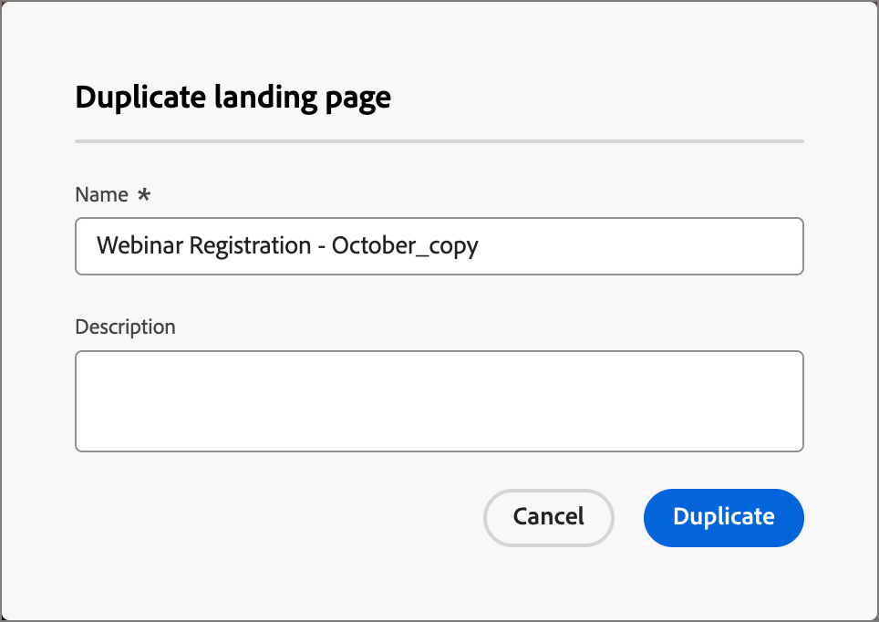

# 登陆页面

登陆页面是一个独立的网页，您可以在联系人和客户单击电子邮件、短信消息或任何数字位置中的链接项目后指引他们。 您可以将这些页面合并到您的历程中，以使潜在客户和客户在Web上查看您的消息并在您的历程中前进。

登陆页面的常见用例：

* 提供选择加入或选择退出营销通信或特定服务。 在电子邮件或其他通信中使用指向目标列表的链接。
* 在发送通信之前收集同意，并在选择加入或选择退出时发送确认电子邮件。
* 使用登陆页面上的表单捕获或更新用户档案数据（渐进式用户档案、偏好设置、注册和类似方案）。
* 将人员引导至为您的历程编排设计的特定于促销活动的信息。
* 将用户重定向到专用Web窗体，而无需在[!DNL Marketo Optimizer]外部构建外部页面。

## 登陆页面工作流程 {#workflow}

要在历程受众的成员单击特定链接时将他们定向到定义的网页，请在[!DNL Marketo Optimizer]中创建登陆页面：

1. [创建页面](./landing-pages-create-publish.md#create-landing-page) — 选择预设，设置主页面，然后添加任何所需的子页面。
1. [设计登陆页面内容](./landing-page-design.md) — 使用拖放可视化设计组件构建页面内容。
1. [测试登陆页面](./landing-pages-create-publish.md#test-landing-page) — 预览该页面并测试表单行为。
1. [发布登陆页面](./landing-pages-create-publish.md#publish-landing-page) — 发布以使该页面处于活动状态并可用于链接。
1. [从您的历程链接到页面](#link-to-landing-page) — 将登陆页面URL添加到电子邮件、短信或历程操作，以便收件人可以访问该页面。

例如，您可以创建和设计登陆页面，以将用户定向到在线信息。 该页面可能包括一个表单，用户可以在其中选择加入或选择退出接收您的通信。 或者，它可能是订阅定期通信（如新闻稿）的机会。

## 访问和管理登陆页面 {#access-manage-landing-pages}

要在[!DNL Marketo Optimizer]中访问登陆页面，请转到左侧导航并展开&#x200B;**[!UICONTROL 内容管理]**。 然后选择&#x200B;**[!UICONTROL 登陆页面]**。 此操作显示实例中创建的所有登陆页面的列表。

{width="800" zoomable="yes"}

该列表按&#x200B;_[!UICONTROL 修改时间]_&#x200B;列排序，最近更新的项目位于顶部。 单击列标题可在升序和降序之间更改。

### 筛选登陆页面列表 {#filter-list}

要按名称搜索登陆页面，请在搜索栏中输入匹配项的文本字符串。 单击&#x200B;_筛选器_&#x200B;图标（）以显示可用的筛选器选项并更改设置以根据指定的条件筛选显示的项。

{width="800" zoomable="yes"}

<!-- 
This is going away? ### Customize the column display

Customize the columns that you want to display in the table by clicking the _Customize table_ icon (  ) at the top right. 

In the dialog, select the columns to display and click **[!UICONTROL Apply]**.

{width="300"} 
-->

### 登陆页面状态和生命周期 {#landing-page-status}

登陆页面状态决定了在电子邮件和短信内容中进行链接的可用性，以及您可以对登陆页面进行的更改。

| 状态 | 描述 |
| -------------------- | ----------- |
| 草稿 | 创建登陆页面时，该页面处于草稿状态。 在您定义或编辑可视内容时，它保持此状态，直到您将其发布为托管页面。 可用操作：  <ul><li>编辑名称或描述</li><li>编辑链接URL</li><li>在可视设计空间中编辑</li><li>发布</li><li>重复</li><li>删除</li></ul> |
| 发布日期 | 当您发布登陆页面时，该页面托管在[!DNL Marketo Optimizer]实例上，可供在电子邮件或短信消息内容中进行链接。 可用操作：  <ul><li>编辑名称或描述</li><li>编辑链接URL</li><li>在电子邮件或短信消息内容中添加链接</li><li>创建草稿版本</li><li>重复</li><li>删除</li></ul> |
| 以草稿发布 | 从已发布的登陆页面创建草稿时，已发布的版本会保留，并且草稿内容可以在可视设计空间中修改。 如果您发布草稿版本，则该草稿版本会替换当前已发布的版本，并且托管页面中的内容会更新。 可用操作：  <ul><li>编辑名称或描述</li><li>编辑链接URL</li><li>在电子邮件或短信消息内容中添加链接</li><li>在可视设计空间中编辑草稿版本</li><li>发布草稿版本</li><li>重复</li><li>删除（删除两个版本）</li><li>放弃草稿（返回到已发布状态）</li></ul> |

{zoomable="yes"}

## 编辑登陆页面 {#edit-landing-page}

对登陆页面的编辑取决于其当前状态：

* 当登陆页面处于&#x200B;**_草稿_**&#x200B;状态时，您可以编辑其任何详细信息、URL和可视内容。
* 当登陆页面处于&#x200B;**_已发布_**&#x200B;状态时，您可以编辑描述，但不能编辑名称。 要更改可视内容，您必须创建页面的草稿版本。
* 当登陆页面处于&#x200B;**_已发布，状态为_**&#x200B;草稿时，编辑详细信息仅限于描述。 您还可以编辑草稿版本的可视内容。

>[!BEGINTABS]

>[!TAB 草稿]

1. 从&#x200B;_[!UICONTROL 登陆页面]_&#x200B;列表页面中，单击登陆页面名称以将其打开。

   此时将显示可视化内容的预览，其中登陆页面的详细信息位于右侧。

1. 修改任何详细信息，如名称和描述。

   {width="700" zoomable="yes"}

1. 若要更改可视化设计空间中的内容，请单击&#x200B;**[!UICONTROL 编辑登陆页面]**。

   根据需要使用可视化设计工具：

   * [添加结构和内容](./landing-page-design.md#structure-content-landing-page)
   * [添加资源](./landing-page-design.md#add-assets)
   * [导航图层、设置和样式](./landing-page-design.md#navigate-layers-settings-styles)
   * [个性化内容](./landing-page-design.md#personalize-content)
   * [编辑链接的URL跟踪](./landing-page-design.md#linked-url-tracking)

1. 单击&#x200B;**[!UICONTROL 保存]**，或单击&#x200B;**[!UICONTROL 保存并关闭]**&#x200B;以返回登陆页面的详细信息。

1. 当页面符合您的条件并且您想要显示时，请单击&#x200B;**[!UICONTROL 发布]**。

>[!TAB 已发布]

1. 从&#x200B;_[!UICONTROL 登陆页面]_&#x200B;列表页面，单击页面名称以将其打开。

   此时将显示可视化内容的预览，其中登陆页面的详细信息位于右侧。

1. 如果需要，请修改说明。

   对于已发布的登陆页面，无法更改所有其他详细信息。

1. 如果要更新内容，请单击右侧的&#x200B;**[!UICONTROL 编辑登陆页面]**。

   在对话框中单击&#x200B;**[!UICONTROL 创建草稿版本]**&#x200B;以在可视设计空间中打开草稿版本。

   根据需要使用可视化设计工具：

   * [添加结构和内容](./landing-page-design.md#structure-content-landing-page)
   * [添加资源](./landing-page-design.md#add-assets)
   * [导航图层、设置和样式](./landing-page-design.md#navigate-layers-settings-styles)
   * [个性化内容](./landing-page-design.md#personalize-content)
   * [编辑链接的URL跟踪](./landing-page-design.md#linked-url-tracking)

1. 单击&#x200B;**[!UICONTROL 保存]**，或单击&#x200B;**[!UICONTROL 保存并关闭]**&#x200B;以返回登陆页面的详细信息。

1. 当草稿登陆页面符合您的条件并且您希望在已发布的页面上提供更改时，单击&#x200B;**[!UICONTROL 发布]**。

   发布草稿版本时，草稿版本会替换当前已发布的版本，并且页面URL的内容会更新。

>[!TAB 已发布草稿]

打开登陆页面时，将显示草稿版本。 预览空间顶部的选项卡允许您在已发布版本和草稿版本之间切换显示。 草稿操作和详细信息将显示在右侧。

{width="700" zoomable="yes"}的预览和详细信息

更新内容(_T):_

1. 单击右上方的&#x200B;**[!UICONTROL 编辑登陆页面]**。 根据需要使用可视化设计工具：

   * [添加结构和内容](./landing-page-design.md#structure-content-landing-page)
   * [添加资源](./landing-page-design.md#add-assets)
   * [导航图层、设置和样式](./landing-page-design.md#navigate-layers-settings-styles)
   * [个性化内容](./landing-page-design.md#personalize-content)
   * [编辑链接的URL跟踪](./landing-page-design.md#linked-url-tracking)

1. 单击&#x200B;**[!UICONTROL 保存]**，或单击&#x200B;**[!UICONTROL 保存并关闭]**&#x200B;以返回登陆页面的详细信息。

1. 当草稿页面符合您的条件并且您想要使更改可用时，单击&#x200B;**[!UICONTROL 发布]**。

   发布草稿版本时，草稿版本会替换当前已发布的版本，并且托管页面中的内容会更新。

>[!ENDTABS]

## 复制登陆页面 {#duplicate-landing-page}

您可以使用以下任一方法复制登陆页面：

* 从&#x200B;_[!UICONTROL 登陆页面]_&#x200B;列表页面，单击&#x200B;_更多_&#x200B;图标(**...**) 在登陆页面名称旁边，然后选择&#x200B;**[!UICONTROL 复制]**。
* 在登陆页面详细信息页面的右上角，单击&#x200B;**[!UICONTROL ...更多]**&#x200B;并选择&#x200B;**[!UICONTROL 复制]**。

{width="600" zoomable="yes"}

在对话框中，输入有用的名称（唯一）和描述（可选）。 单击&#x200B;**[!UICONTROL 复制]**&#x200B;以完成操作。

{width="350"}

然后，重复的（新）页面出现在&#x200B;_登陆页面_&#x200B;列表中。

## 删除登陆页面 {#delete-landing-page}

您可以使用以下任一方法删除登陆页面：

* 从&#x200B;_[!UICONTROL 登陆页面]_&#x200B;列表页面，单击&#x200B;_更多_&#x200B;图标(**...**) 在登陆页面名称旁边，然后选择&#x200B;**[!UICONTROL 删除]**。
* 在登陆页面详细信息页面的右上角，单击&#x200B;**[!UICONTROL ...更多]**&#x200B;并选择&#x200B;**[!UICONTROL 删除]**。

此操作将打开确认对话框。 您可以通过单击&#x200B;**[!UICONTROL 取消]**&#x200B;或单击&#x200B;**[!UICONTROL 删除]**&#x200B;确认删除来中止该进程。

{width="400"}

## 链接到登陆页面 {#link-to-landing-page}

作为生成电子邮件、片段和页面内容的营销人员或创意人员，您可以嵌入指向在您的[!DNL Marketo Optimizer]实例中创建的已发布（实时）登陆页面的链接。

1. 当您在片段、电子邮件、登陆页面或模板的可视设计空间中工作时，为链接选择文本摘录、按钮组件或图像组件。

   **[!UICONTROL 链接]**&#x200B;选项显示在右侧面板中。

1. 对于&#x200B;**[!UICONTROL Type]**&#x200B;选项，请选择&#x200B;**[!UICONTROL 登陆页面]**。

   登陆页面的{width="700" zoomable="yes"}

1. 对于&#x200B;**[!UICONTROL 登陆页面]**&#x200B;选项，请单击&#x200B;_选择页面_&#x200B;图标（）。

1. 在“选择登陆页面”对话框中，将&#x200B;**[!UICONTROL 登陆页面源]**&#x200B;设置为&#x200B;**[!UICONTROL Journey Optimizer B2B edition]**，从已发布的页面列表中选中该登陆页面的复选框，然后单击&#x200B;**[!UICONTROL 选择]**。

   登陆页面的{width="600" zoomable="yes"}

1. 对于&#x200B;**[!UICONTROL Target]**&#x200B;选项，请选择链接目标行为：

   * **[!UICONTROL 无]** — 使用浏览器默认行为打开链接。
   * **[!UICONTROL 空白]** — 在新窗口或选项卡中打开链接。
   * **[!UICONTROL Self]** — 在同一帧中打开链接。
   * **[!UICONTROL 父项]** — 在父框架中打开链接。
   * **[!UICONTROL Top]** — 在窗口的整个正文中打开链接。

1. （仅限文本链接）如果要为链接的文本加下划线，请选中&#x200B;**[!UICONTROL 加下划线链接]**&#x200B;复选框。

   通过选择右侧面板中的&#x200B;**[!UICONTROL 样式]**&#x200B;选项卡，可以为链接文本设置其他样式，包括链接颜色。
