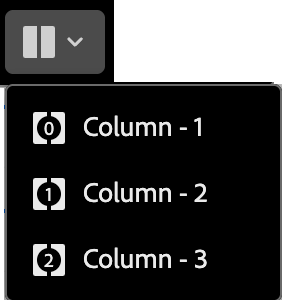

# 结构组件 {#structure-components}

>[!CONTEXTUALHELP]
>id="ajo-b2b-prime_structure_components_email"
>title="关于结构组件"
>abstract="结构组件是一种布局元素，可用于设计电子邮件结构。"

>[!CONTEXTUALHELP]
>id="ajo-b2b-prime_structure_components_landing_page"
>title="关于结构组件"
>abstract="结构组件是一种布局元素，可用于设计页面结构。"

>[!CONTEXTUALHELP]
>id="ajo-b2b-prime_structure_components_fragment"
>title="关于结构组件"
>abstract="结构组件是一种布局元素，可用于设计一个片段的结构。"

>[!CONTEXTUALHELP]
>id="ajo-b2b-prime_structure_components_template"
>title="关于结构组件"
>abstract="结构组件是一种布局元素，可用于设计模板的结构。"

使用可视化设计空间中的&#x200B;_结构组件_&#x200B;定义内容的结构。 通过简单的拖放操作添加和移动结构元素，您可以快速定义内容布局的形状。 每个结构组件跨越水平空间，您可以栈叠它们以垂直构建布局。<!-- Divide each component into columns to form each content block that you need, then add [content components](./content-components.md) inside them to populate the layout. -->

## 结构库 {#structure-library}

在&#x200B;_[!UICONTROL 组件]_&#x200B;库的顶部，**[!UICONTROL 结构]**&#x200B;部分显示可用的结构组件：

| 图标 | 组件 | 描述 |
| ----- | ----------- | ----------- |
|  | [!UICONTROL 1:1列] | 填充空格宽度的单列容器。 |
|  | [!UICONTROL 1:2列左对齐] | 两列容器，使用1:2的比例填充空间的宽度。 第一（左）列占据宽度的三分之一，第二（右）列占据剩余的三分之二。 |
|  | [!UICONTROL 1:3列左对齐] | 两列容器，使用1:3的比例填充空间的宽度。 第一（左）柱占据宽度的四分之一，第二（右）柱占据剩余的四分之三。 |
|  | [!UICONTROL 2:1列右对齐] | 由两列构成的容器，使用2:1的比率填充空间的宽度。 第一（左）列占据宽度的三分之二，第二（右）列占据剩余的三分之一。 |
|  | [!UICONTROL 2:2列] | 由两列构成的容器，使用2:2的比率填充空间的宽度。 左列和右列的宽度相等。 |
|  | [!UICONTROL 3:1列右对齐] | 两列容器，使用3:1的比率填充空间的宽度。 第一（左）柱占据宽度的四分之三(75%)，第二（右）柱占据剩余的四分之一(25%)。 |
|  | [!UICONTROL 3:3列] | 三列容器，使用3:3的比率填充空间的宽度。 三列的宽度相等。 |
|  | [!UICONTROL 4:4列] | 四列容器，使用4:4的比率填充空间的宽度。 四列的宽度相等。 |
|  | [!UICONTROL n:n列] | 一种可自定义的列结构，根据您定义的列填充空间。 您可以设置列数（介于2和10之间）并单独设置每列的宽度。 [了解详情](#change-nn-columns) |

## 添加结构组件 {#add-structure-components}

在为电子邮件、登陆页面或片段设计内容时，添加每个结构组件以构建布局。 从左侧的&#x200B;**[!UICONTROL Structures]**&#x200B;部分拖动一个项，并将其放到画布上。 您可以使用工具栏选择列，并使用右侧面板上的&#x200B;_设置_&#x200B;和&#x200B;_样式_&#x200B;选项卡定义所选组件或列的参数。

{width="800" zoomable="yes"}

### 组件工具栏 {#component-toolbar}

在画布中选择工具栏后，该工具栏将显示在画布中。 可用的工具提供了一种简单的选择列和应用组件函数的方法。

{width="150"}

| 工具 | 名称 | 使用情况 |
| ---- | ---- | ----- |
| {width="40"} | 启用条件内容 | （电子邮件和片段）为组件启用条件变体。 |
| {width="100"} | 选择列 | 按编号选择列。 选择列后，可以应用列设置和样式。 |
| {width="40"} | 重复 | 创建组件的副本并直接将其添加到下方。 |
| {width="40"} | 删除 | 删除组件。 |

### 组件设置 {#component-settings}

添加组件后，将在可视设计空间中选择该组件，其属性将显示在右侧面板中。 默认显示&#x200B;_[!UICONTROL 设置]_&#x200B;选项卡。 您还可以随时选择结构组件以更改设置。

#### 显示选项

如果要从桌面或移动设备显示中排除该组件，请更改&#x200B;**[!UICONTROL 显示选项]**&#x200B;设置。 默认值&#x200B;_[!UICONTROL 在所有设备上显示]_，允许在所有设备上显示。

{width="400" zoomable="yes"}

选择其他设置以使组件按设备类型专用：

* _[!UICONTROL 仅在桌面设备上显示]_ — 当您想要在桌面设备上显示组件并为移动设备排除该组件时，请选择此设置。
* _[!UICONTROL 仅在移动设备上显示]_ — 如果要在移动设备（如手机和平板电脑）上显示组件，请选择此设置，并将其排除在桌面设备之外。

#### 页眉和页脚

您可以在电子邮件或登陆页面中将结构组件指定为HTML页眉或页脚。 在画布中选择结构组件后，单击&#x200B;**[!UICONTROL 页眉]**&#x200B;或&#x200B;**[!UICONTROL 页脚]**&#x200B;选项。 只能有一个页眉或页脚，如果分配了另一个组件，则该选项不可用。

{width="600" zoomable="yes"}

通过选择元件并单击选项可移除标题或页脚指定。

### 栈叠的列 {#stacked-columns}

对于较小的屏幕或显示窗口，除非更改默认设置，否则结构组件中的列显示为栈叠。 选择了多列结构组件后，将切换滑块向右移动，更改&#x200B;**[!UICONTROL 在移动设备上不栈叠列]**&#x200B;设置。

{width="250"}

## 组件样式 {#component-styles}

添加组件后，将在可视设计空间中选择该组件，其属性将显示在右侧面板中。 您还可以随时选择组件以更改设置和样式。

### 背景 {#background}

在右侧面板中选择&#x200B;_[!UICONTROL 样式]_&#x200B;选项卡后，使用&#x200B;**[!UICONTROL 背景]**&#x200B;部分定义用作结构组件背景的颜色和可选图像。

#### [!UICONTROL 背景颜色]

选中复选框，然后单击颜色方块以从选取器中选择颜色。 您可以通过输入已知的RGB、HSL、HSB或十六进制值来选择颜色。 或者，使用颜色滑块和颜色字段来选择颜色。

{width="300"}

#### [!UICONTROL 背景图像] {#background-image}

移动切换选择器以启用背景图像设置。

{width="250"}

单击&#x200B;**[!UICONTROL 选择资源]**&#x200B;以打开资源选择器，您可以从中从[Assets库](./digital-asset-management.md#assets-authoring)中选择图像。

使用&#x200B;**[!UICONTROL 图像位置]**&#x200B;选项选择图像填充结构组件的方式。 放置设置遵循标准[HTML背景图像填充和对齐属性](https://www.w3schools.com/html/html_images_background.asp){target="_blank"}。

{width="250"}

### 其他样式 {#other-styles}

您可以应用其他结构组件样式来调整其在电子邮件或登陆页面中的显示。 有关这些内置选项之外的样式，请参阅[为您的内容添加自定义CSS](./design-custom-css.md)。

+++边框

{{styles-border}}

+++

+++边距

{{styles-margin}}

+++

+++高级

{{styles-advanced}}

+++

## 列 {#columns}

使用组件工具栏中的&#x200B;_选择列_&#x200B;工具选择列。 然后，您可以使用列工具栏更改列选择、删除列或为列应用条件内容变体。 列的参数显示在右侧的&#x200B;_[!UICONTROL 设置]_&#x200B;和&#x200B;_[!UICONTROL 样式]_&#x200B;选项卡中。

{width="500"}

| 工具 | 名称 | 使用情况 |
| ---- | ---- | ----- |
| — | 清除列 | 清除列中的内容。 请参阅列工具栏图中的第一个工具。 |
| {width="40"} | 启用条件内容 | （电子邮件和片段）为列启用条件变体。 |
| {width="100"} | 选择列 | 按编号选择列。 选择列后，可以应用设置和样式。 |

### 更改n:n列 {#change-nn-columns}

对于大多数结构元件，列宽是静态的。 添加&#x200B;_[!UICONTROL n:n列]_&#x200B;组件时，可以更改列数和列大小。 n:n列组件以宽度相等(20%)的五列开头。

>[!NOTE]
>
>每个列大小不能小于结构组件总宽度的10%。 只能删除空列。

在画布中选择组件后，使用右侧面板中的&#x200B;**[!UICONTROL 列数]**&#x200B;选项更改列数。 单击向上箭头图标和向下箭头图标以增加或减少列数，或在字段中输入列数。

{width="650" zoomable="yes"}

在画布中，移动列大小调整图标以调整所选列的宽度。 当增加或减少宽度时，相邻列也会进行调整，以便所有列都占组件宽度的100%。

{width="500" zoomable="yes"}

### 列样式 {#column-styles}

在画布中选择列后，您可以设置样式以应用于该列。

+++背景

* **[!UICONTROL 背景颜色]** — 选中该复选框并单击颜色正方形以从选取器中选择颜色。 您可以通过输入已知的RGB、HSL、HSB或十六进制值来选择颜色。 或者，可以使用颜色滑块和颜色域来选择颜色。

  {width="300"}

* **[!UICONTROL 背景图像]** — 移动切换选择器以启用背景图像设置。

  {width="250"}

  选择资源源类型并[选择图像文件](#background-image)。

+++

+++边框

{{styles-border}}

+++

+++对齐方式

{{styles-alignment-v}}

+++

+++边距

{{styles-margin}}

+++

+++高级

{{styles-advanced}}

+++

## 导航树 {#navigation-tree}

在可视设计空间中，可以使用导航树访问结构组件，包括列和内容。 单击左侧的&#x200B;_[!UICONTROL 导航树]_&#x200B;图标（）以显示该树。

{width="800" zoomable="yes"}

_[!UICONTROL Body]_&#x200B;元素是树结构的根。 单击树中的任意元件或列子元素以在画布上将其选中。 右侧的&#x200B;_[!UICONTROL 设置]_&#x200B;和&#x200B;_[!UICONTROL 样式]_&#x200B;选项卡显示该组件或列的参数。

在可视设计空间中显示的{width="800" zoomable="yes"}
