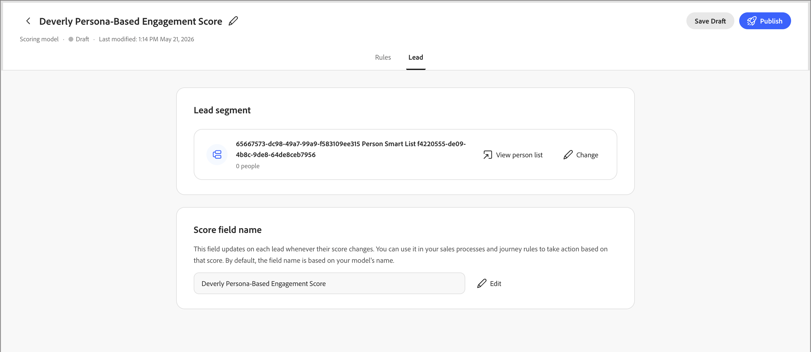

# Scoring Studio

Scoring Studio包括模型列表、每个模型的可编辑画布和[同事聊天界面](../agents/chat-interface.md)。 使用画布直接查看或调整维度和信号，而同事仍与您一起建议更改自然语言。 有关从提示构建模型的信息，请参阅&#x200B;[_创建自定义评分模型_](../agents/lead-scoring-model.md)。

## 模型列表 {#model-list}

模型列表是Scoring Studio的登陆视图。 它将[!DNL Marketo Optimizer]实例中的每个评分模型显示为表中的行，或者如果您切换到网格视图，则显示为卡片。

| 列 | 描述 |
| --- | --- |
| 名称 | 选择模型名称以在画布上将其打开。 |
| 状态 | _[!UICONTROL 活动]_、_[!UICONTROL 草稿]_&#x200B;或&#x200B;_[!UICONTROL 已存档]_。 |
| 维度 | 模型中的尺寸数。 |
| 信号 | 模型中的信号数。 |
| 上次修改日期 | 上次更改模型的日期。 |
| 上次修改者 | 上次更改模型的人员。 |
| 创建日期 | 创建模型的日期。 |
| 创建者 | 创建模型的人员。 |

{width="800" zoomable="yes"}

使用搜索字段按名称查找模型，或按状态筛选列表。 选择一行的&#x200B;**[!UICONTROL 更多菜单]**&#x200B;到&#x200B;**[!UICONTROL 编辑]**、**[!UICONTROL 复制]**、**[!UICONTROL 存档]**&#x200B;或&#x200B;**[!UICONTROL 删除]**&#x200B;模型。

活动模型是只读的。 要更改它，请复制它并编辑副本。 然后，存档原始副本并发布修改后的副本。

## 模型画布 {#model-canvas}

选择模型名称会在画布上将其打开。 每个打开的模型都显示为自己的选项卡，因此您可以跨多个模型工作。 画布已组织为选项卡，包括&#x200B;**[!UICONTROL 规则]**&#x200B;和&#x200B;**[!UICONTROL 潜在客户]**。

在&#x200B;**[!UICONTROL 规则]**&#x200B;选项卡上，模型中的每个维度都是画布上的列。 每个列标题都显示维度名称及其顶部的点总数，例如`20 / 30 pts`，其进度条将填满作为其信号贡献点的进度条。

{width="700" zoomable="yes"}

在每个维度内，每个信号都显示为一个卡片，显示其名称、点值以及与其匹配的频率（例如，`1 time / day`）或不依赖于活动的基于属性的信号`Static`。

当Co-worker检测到跨多个活动的模式时，它可以将它们组合到单个复合信号卡中，以总结每个条件。

## 配置信号 {#configure-signal}

要查看或更改信号，请执行以下步骤。

1. 选择&#x200B;**[!UICONTROL 编辑草稿]**。

1. 选择画布上的信号卡。

   “属性”面板将在画布右侧打开。

   {width="700" zoomable="yes"}

1. 选择&#x200B;**[!UICONTROL 编辑]**&#x200B;图标（），然后更新信号属性：

   * 在&#x200B;**[!UICONTROL Signal]**&#x200B;下，确认信号类型（活动或属性）及其得分的特定活动或属性。

   * 在&#x200B;**[!UICONTROL 于]**&#x200B;触发此项下，设置必须匹配的条件。

     添加要使用的项，如特定页面，以及条件必须为true的&#x200B;**[!UICONTROL Any of]**&#x200B;还是&#x200B;**[!UICONTROL All of]**。

   * 在&#x200B;**[!UICONTROL 点]**&#x200B;下，设置信号贡献的点数。

     （可选）设置&#x200B;**[!UICONTROL Cap]**&#x200B;以限制每人可贡献的点数。 Co-worker根据模型中的其他信号显示建议的点范围。

   * 对于基于活动的信号，请在信号奖励点之前设置所需的&#x200B;**[!UICONTROL 频率]**。

     （可选）设置&#x200B;**[!UICONTROL 衰减]**&#x200B;百分比，以缩短在设定的天数后信号的点数。

   * 启用&#x200B;**[!UICONTROL 避免对相同的操作打两次分]**&#x200B;选项以仅为每个人打一次分，无论该活动发生多少次。

     禁用选项，以便在每次活动时奖励点数。 默认情况下，此设置处于打开状态。

1. 选择&#x200B;**[!UICONTROL 保存]**&#x200B;以应用更改并返回画布。

## 潜在客户区段 {#lead-segment}

每个评分模型都会对一个潜在客户区段进行评分，该区段是对现有人员列表的引用，而不是您在Scoring Studio中定义的规则。 Co-worker创建模型时，会选择一个匹配的列表或创建一个新列表。

要更改列表，请选择&#x200B;**[!UICONTROL 潜在客户]**&#x200B;选项卡，然后选择潜在客户区段旁边的&#x200B;**[!UICONTROL 更改]**。

{width="700" zoomable="yes"}

潜在客户段使用以下两种列表类型之一：

* **静态列表** — 创建列表时捕获的固定人员集。
* **智能列表** — 每当模型运行时都会重新评估其成员资格规则的列表，因此该区段始终反映列表条件。

模型预览显示区段名称、其成员计数以及直接打开该列表的&#x200B;**[!UICONTROL 查看人员列表]**&#x200B;链接。 有关管理列表的详细信息，请参阅&#x200B;[_人员列表_](../audiences/people-lists.md)。

如果引用的列表为空或稍后被删除，则模型将停止评分，而不是回退到整个受众。 在分配有效的非空列表之前，不会为潜在客户计分。

在商机区段下，**[!UICONTROL 得分字段名称]**&#x200B;卡显示模型将其得分写入其中的商机属性。 默认情况下，字段名称与模型名称匹配。 选择&#x200B;**[!UICONTROL 编辑]**&#x200B;以对其进行重命名。

## 发布和计划 {#publish-schedule}

模型准备就绪后，选择&#x200B;**[!UICONTROL 发布]**。 选择模型给受众评分的频率：每日、每周或每月。

有关完整发布过程，包括[!DNL Marketo Optimizer]如何自动设置评分字段，请参阅&#x200B;[_发布评分模型_](../agents/lead-scoring-model.md#publish-model)。
