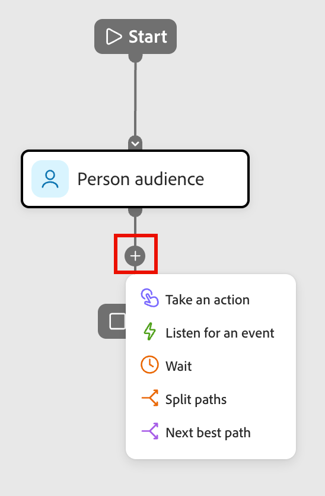
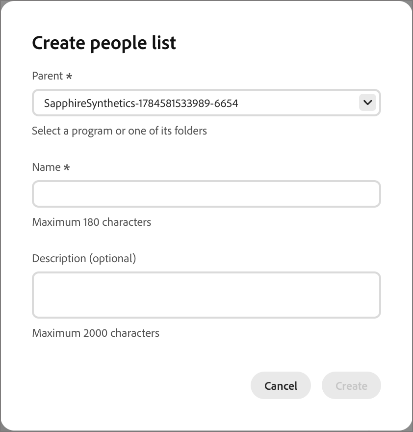

# 执行操作节点

在人员历程中，当您想要将更改应用于节点路径上的所有人员时，对人员使用操作。

## 操作和限制 {#actions}

| 操作 | 约束 |
| ------ | ----------- |
| **[!UICONTROL 激活到目标]** | <li>选择或创建静态列表 <li>如果列表没有激活的目标，请将该列表激活到一个或多个目标 |
| **[!UICONTROL 将人员添加到历程]** | <li>选择计划的或实时历程 <li>未应用目标历程的受众条件 |
| **[!UICONTROL 添加到列表]** | <li>创建新的静态列表或选择现有列表 |
| **[!UICONTROL 添加到Marketo Engage列表]** | <li>在Marketo Engage中选择静态列表 |
| **[!UICONTROL 更改数据值]** | <li>选择人员属性 <li>设置新值 |
| **[!UICONTROL 更改项目群中的状态]** | <li>选择项目<li>选择新状态 |
| **[!UICONTROL 更改网络研讨会成员状态]** | <li>选择项目<li>选择新状态 |
| **[!UICONTROL 从列表中删除]** | <li>选择静态列表 <li>如果当前不是成员，则跳过人员 |
| **[!UICONTROL 从Marketo Engage列表中删除]** | <li>在Marketo Engage中选择静态列表 <li>如果当前不是成员，则跳过人员 |
| **[!UICONTROL 从历程中删除人员]** | <li>选择实时历程 <li>如果当前不是目标历程成员，则跳过人员 |
| **[!UICONTROL 请求Marketo Engage促销活动]** | <li>选择Marketo Engage营销活动 |
| **[!UICONTROL 发送电子邮件]** | <li>创建、编辑或使用人工智能个性化电子邮件 <li>发送时间优化（可选） |
| **[!UICONTROL 发送WhatsApp]** | <li>选择WhatsApp消息 |

<!-- 
removed? | **[!UICONTROL Change Program Data]** | <li>Select program attribute <li>Set new value | 
-->

## 添加操作节点 {#add-an-action-node}

1. 导航到历程画布。

1. 单击路径上的加号( **+** )图标，然后选择&#x200B;**[!UICONTROL 执行操作]**。

   {width="200"}

1. 在右侧的节点属性中，从列表中选择一个操作并设置该操作的任何值。

+++激活到目标

使用此操作将人员添加到静态列表，并直接从历程将该列表激活到目标。 您可以使用现有的静态列表，或专门为历程创建一个列表。

>[!PREREQUISITES]
>
>在设置&#x200B;_激活到目标_&#x200B;历程节点之前，必须为您的[!DNL Marketo Optimizer]沙盒配置一个或多个[目标](../audiences/destinations.md)。

{width="450"}

在&#x200B;**[!UICONTROL 添加到列表]**&#x200B;下，选择以下选项之一：

* **[!UICONTROL 创建]** — 创建新的静态列表并向其中添加人员。 此列表在&#x200B;**[!UICONTROL 人员列表]**&#x200B;下立即可用。

  为列表选择父项目并输入&#x200B;**[!UICONTROL 名称]**（必需）和&#x200B;**[!UICONTROL 描述]**（可选）。 单击&#x200B;**[!UICONTROL 创建]**&#x200B;以添加节点的新列表。

  {width="375"}

* **[!UICONTROL 选择]** — 选择现有静态列表，以添加到达该节点的人员。

  选中现有静态列表的复选框，然后单击&#x200B;**[!UICONTROL 保存]**。

  {width="700" zoomable="yes"}

到达节点的任何人都将添加到选定的静态列表，但只有在将该列表激活到目标之后，操作才会完成：

* 如果所选列表已激活，则其目标将显示在&#x200B;**[!UICONTROL 目标]**&#x200B;下，操作已就绪。
* 否则，将显示&#x200B;_至少需要一个目标_&#x200B;消息。 单击&#x200B;**[!UICONTROL 将列表激活到目标]**，选择目标，然后单击&#x200B;**[!UICONTROL 保存]**。 在确认对话框中，单击&#x200B;**[!UICONTROL 激活]**。

{width="600" zoomable="yes"}

激活完成后，目标将显示在&#x200B;**[!UICONTROL 目标]**&#x200B;下，并且操作已就绪。 如果需要，可将列表激活到其他目标。

到达节点的任何人都将添加到选定的静态列表，该列表将激活到选定的目标，以便他们被添加到该目标受众，进而添加到受众馈送的任何营销活动。

+++

+++[!UICONTROL 将人员添加到历程]

使用此操作将人员添加到其他计划或实时历程。 通过此操作添加的人员会立即添加到目标历程的受众，但不应用目标历程的受众条件。

{width="450"}

+++

+++[!UICONTROL 添加到列表]

使用此操作可在Marketo Optimizer中将人员添加到静态列表。

{width="450"}

选择下列选项之一：

* **[!UICONTROL 创建]** — 创建新的静态列表资源并向其中添加人员。 该列表可立即供Marketo Optimizer中的其他资源使用。
* **[!UICONTROL 选择]** — 选择现有静态列表资源，您要在该资源中添加到达该节点的人员。

+++

+++[!UICONTROL 添加到Marketo Engage列表]

使用此操作可将人员添加到Marketo Engage中的静态列表。

{width="450"}

+++

+++[!UICONTROL 更改数据值]

使用此操作可更新人员记录上的属性值。 选择属性并设置新值。

>[!TIP]
>
>要清除属性的值，将该值设置为`NULL`。

{width="450"}

+++

+++[!UICONTROL 更改项目群中的状态]

使用此操作可更改Marketo Engage项目中人员的状态。 选择程序，然后选择新状态。

{width="450"}

+++

+++[!UICONTROL 更改网络研讨会成员状态]

使用此操作可更改人员相对于交互式网络研讨会的状态。 选择网络研讨会，然后选择新状态。

{width="450"}

+++

+++[!UICONTROL 从列表中删除]

使用此操作可从Marketo Optimizer的静态列表中删除人员。 如果某个人当前不是该列表的成员，则会为该人员跳过该操作。

{width="450"}

+++

+++[!UICONTROL 从Marketo Engage列表中删除]

使用此操作可从Marketo Engage的静态列表中删除人员。 如果某个人当前不是该列表的成员，则会为该人员跳过该操作。

{width="450"}

+++

+++[!UICONTROL 从历程中删除人员]

使用此操作可将人员从其他实时人员历程中删除。 该人员将立即从目标历程中删除，并且不会对其执行进一步操作。 如果人员当前不是目标历程的成员，则会为该人员跳过操作。

{width="450"}

+++

+++[!UICONTROL 请求Marketo Engage促销活动]

使用此操作可在连接的Marketo Engage实例中将人员添加到请求营销活动。 选择要请求的Marketo Engage营销活动。

{width="450"}

+++

+++[!UICONTROL 发送电子邮件]

使用此操作向已选择加入的人员发送电子邮件。 取消订阅、列入阻止列表、电子邮件已暂停或营销已暂停的用户将跳过此操作。

{width="450"}

您可以创建电子邮件、编辑现有电子邮件或使用AI个性化电子邮件。 有关创建和编辑电子邮件的信息，请参阅[电子邮件渠道](./email-channel.md)。 要为现有电子邮件生成基于角色的变体，请参阅[按角色个性化电子邮件内容](../agents/personalize-content.md)。

您可以使用[发送时间优化](./email-send-time-optimization.md)，通过预测每个用户档案最有可能参与的时间，使电子邮件投放时间个性化。

+++

+++[!UICONTROL 发送WhatsApp]

使用此操作发送WhatsApp消息。 您可以在可视设计空间创建、个性化和预览WhatsApp消息（请参阅[WhatsApp创作](../content/whatsapp-authoring.md)）。

{width="450"}

+++
