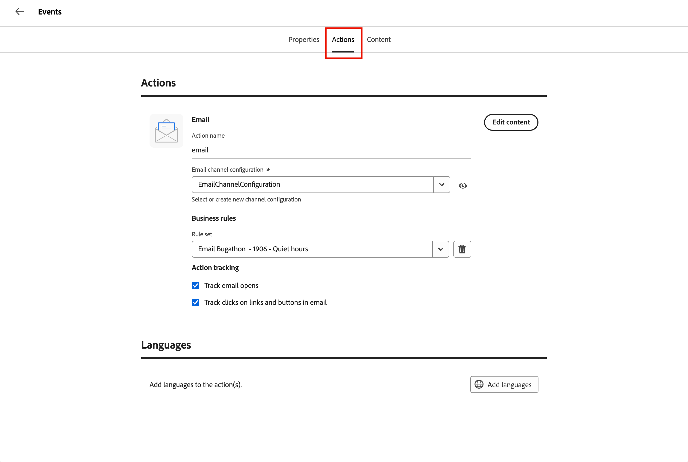

# 向历程添加电子邮件

[!DNL Adobe Marketo Optimizer]为B2B营销人员带来现代的企业级电子邮件创作和投放体验。

>[!NOTE]
>
>如果您是第一次发送电子邮件，请确保已配置[电子邮件可投放性](../start/email-deliverability.md)和所需的[电子邮件渠道](../admin/email-channel-configuration.md)。

<!-- 
* **Email channel configurations** - Manage the sender identity, reply behavior, marketing vs. transactional message types, and tracking.
* **Email deliverability controls** - Set up your email deliverability channel, including subdomain delegation (Fully Delegated and CNAME methods), DMARC, SPF/DKIM auto-configuration, and shared IP pool support.
* **Send Email action** - From a journey, add a _Send email_ action node, including personalization using profile attributes (Handlebars syntax).
* **Visual drag-and-drop email design tools** -  Design your email content with structures, content components, themes, dark-mode support, and reusable visual fragments.
* **Marketo Design Studio assets** — Choose images and assets from a one-time copy of your Marketo Engage asset library directly inside the email canvas.
* **Reusable templates and fragments** — Save common headers, footers, CTAs, and full email layouts and reuse them across journeys.
* **Role-Based Access Control (RBAC)** — Apply granular permissions for creating, editing, approving, and sending email. 
-->

## 当前限制 {#limitations}

* **测试用户档案、模拟内容和发送校样**&#x200B;在此版本中不可用。 Litmus渲染和基于SpamAssassin的垃圾邮件报告均在GA路线图上。
* **此版本中没有帐户级别的个性化和自定义对象数据**。 使用配置文件属性。
* 正式发行时&#x200B;**Velocity到Handlebars自动迁移**&#x200B;现有的Marketo Engage模板。
* 即将发布的版本中随附&#x200B;**电子邮件**（内联评论、@mentions件、请求审阅工作流）中的评论和协作。
* **AEM Assets、AEM Content Fragments和Adobe Express**&#x200B;集成位于&#x200B;_快速跟进_&#x200B;路线图中。

## 重要概念 {#key-concepts}

在为人员历程创建电子邮件并创作电子邮件内容之前，请查看以下概念：

| 概念 | 在[!DNL Adobe Marketo Optimizer] |
| ------- | ---------------------- |
| **_电子邮件设计空间_** | 用于撰写电子邮件内容的可视化画布和设计工具。 它包括拖放布局组件、模板、片段、主题和个性化编辑器。 |
| **_模板_** | 可用于创建新电子邮件的可重用电子邮件布局。 模板可以是Adobe提供的内置示例模板，也可以是您的团队创建的自定义模板。 |
| **_可视片段_** | 可插入到多个电子邮件中的可重用内容块（例如页眉、页脚、CTA、法律免责声明）。 更新片段会将更改传播到使用它的每封电子邮件。 |
| **_主题_** | 可在电子邮件中应用的可重用样式预设（颜色、排版规则、间距、按钮样式）。 |
| **_Personalization令牌_** | 发送时，使用每个收件人的配置文件数据解析的Handlebars表达式（例如`{{profile.firstName}}`）。 |
| **_发送电子邮件操作_** | 历程操作节点，它使用渠道配置和电子邮件内容来投放电子邮件。 |

## 从历程添加电子邮件

要从历程发送电子邮件，请[添加&#x200B;_执行操作_&#x200B;节点](action-nodes.md#add-an-action-node)并将其配置为发送电子邮件。

1. 在历程画布中，单击&#x200B;**+**&#x200B;图标并选择&#x200B;**[!UICONTROL 执行操作]**。

1. 在右侧的节点属性中，将操作设置为&#x200B;**[!UICONTROL 发送电子邮件]**。

   {width="500"}

1. 选择电子邮件源：

   * **创建/编辑电子邮件** — 选择此选项可在电子邮件设计空间中定义电子邮件内容，包括主题行、发件人信息和电子邮件正文。

   * **[!UICONTROL 使用AI个性化电子邮件]** - （_不适用于Beta_）选择此选项可在电子邮件设计空间中优化AI生成的电子邮件。 这些电子邮件已得到优化，以便AI辅助收件箱客户将其摘要和答案加入您的优惠和行动号召中。

1. 单击&#x200B;**[!UICONTROL 创建电子邮件]**。

1. 在&#x200B;_[!UICONTROL 创建电子邮件]_&#x200B;对话框中，输入唯一的&#x200B;**[!UICONTROL 名称]**（必需）和&#x200B;**[!UICONTROL 描述]**（可选）。

   {width="400"}

1. 单击&#x200B;**[!UICONTROL 创建]**。

对于可选的[发送时间优化](email-send-time-optimization.md)，请在创建电子邮件之后配置历程操作节点。

## 定义电子邮件属性和操作 {#define-email-properties}

当您为&#x200B;_[!UICONTROL 发送电子邮件]_&#x200B;节点创建电子邮件时，将打开电子邮件页面。 创建电子邮件后，您还可以通过单击右侧节点属性中的&#x200B;**[!UICONTROL 编辑电子邮件]**&#x200B;访问此页面。

1. （可选）在&#x200B;**[!UICONTROL 属性]**&#x200B;选项卡中，输入要为电子邮件捕获的任何描述性信息。

1. 选择&#x200B;**[!UICONTROL 操作]**&#x200B;选项卡并完成电子邮件的功能设置：

   * **[!UICONTROL 电子邮件]** — 选择或创建要使用的&#x200B;**[!UICONTROL 电子邮件渠道配置]**。

     这是一组可重复使用的电子邮件投放设置，用于定义发件人身份、回复地址、子域、IP池、电子邮件类型（营销或事务性）以及跟踪。 单击&#x200B;_查看_&#x200B;图标以查看所选配置的设置。

     管理员在[电子邮件渠道配置](../admin/email-channel-configuration.md)中创建配置。

   * **[!UICONTROL 业务规则]** — （可选）通过选择规则集将上限或无提示小时规则应用于您的电子邮件操作。

     有关业务规则以及如何定义和激活渠道通信的规则集的详细信息，请参阅&#x200B;[_业务规则_](../admin/business-rules.md)。

   * **[!UICONTROL 操作跟踪]** — 选中要跟踪电子邮件的操作的复选框。

   {width="600" zoomable="yes"}

1. 单击&#x200B;**[!UICONTROL 编辑内容]**，或选择&#x200B;**[!UICONTROL 内容]**&#x200B;选项卡。

1. 输入要显示在电子邮件主题字段中的&#x200B;**[!UICONTROL 主题行]**&#x200B;文本。

   单击&#x200B;_个性化_&#x200B;图标（）以在字段中使用个性化令牌。

1. （可选）选中&#x200B;**[!UICONTROL 优化HTML大小]**&#x200B;复选框以在发布过程中减小电子邮件HTML的大小。

   这有助于防止 Gmail 等电子邮件客户端截断邮件内容，因为此类客户端会截断超过 100 KB 的邮件。 有关详细信息，请参阅&#x200B;[_优化电子邮件HTML大小_](#optimize-html-size)。

1. 单击&#x200B;**[!UICONTROL 编辑电子邮件正文]**&#x200B;以访问可视化设计工具并开始[生成您的内容](../content/email-authoring.md)。

   或者，您可以单击&#x200B;**[!UICONTROL 代码编辑器]**，以纯HTML对您自己的内容进行编码。 如果您已有HTML可重复用于电子邮件设计，则可以将其复制并粘贴到编辑器中。

### 检查警报 {#alerts}

[!DNL Adobe Marketo Optimizer]在电子邮件页面的右上角显示问题。 在激活历程之前解决所有错误。 警告仅为推荐。

**错误** （阻止历程激活）：

* 发件人名称为空
* 缺少主题行
* 电子邮件内容为空

**警告** （推荐）：

* 电子邮件正文中不存在选择退出链接
* HTML的文本版本为空
* 检测到空链接
* 电子邮件超过100 K

## 优化电子邮件 HTML 大小 {#optimize-html-size}

>[!CONTEXTUALHELP]
>id="ajo-b2b-prime_email_minification"
>title="减小 HTML 大小"
>abstract="启用此选项后，系统将在发布时通过移除不必要的空白字符、缩进和非必要注释来压缩电子邮件 HTML。 这有助于防止 Gmail 等电子邮件客户端截断邮件内容，因为此类客户端会截断超过 100 KB 的邮件。"

[!DNL Marketo Optimizer]允许您在发布过程中通过删除不必要的空格、缩进和非必要的注释来压缩电子邮件HTML版本。 缩小HTML的规模可帮助您：

* 避免&#x200B;**电子邮件剪辑** — 某些客户端（如Gmail）截断大于~100 KB的邮件，从而阻止收件人查看完整内容。
* 改进收件人收件箱中的&#x200B;**电子邮件加载时间**。
* 改进&#x200B;**可投放性**&#x200B;并减少带宽使用。

此优化不会自动应用 — 必须在&#x200B;_[!UICONTROL Content]_&#x200B;选项卡中启用它。

<!--  -->

>[!IMPORTANT]
>
> HTML大小缩减仅在发布时应用。

优化是电子邮件客户端安全的：

* 它保留MSO/Outlook条件注释。
* 它不会更改您的实际内容、图像或视频。

>[!NOTE]
>
>电子邮件大小的缩减取决于电子邮件原始HTML结构。 如果内容已紧凑或电子邮件有效负载非常大，则缩减可能最小，并且可能在所有情况下都无法完全阻止剪切。

<!-- 
Proof and simulate workflows are not available in this release. See [Current limitations](#limitations).

### Test HTML size optimization {#optimize-html-proof}

If you have enabled the [HTML size optimization](#optimize-html-size) option, you can evaluate its impact before publishing when sending proofs. Follow the following steps.

1. In the email design space, click the _Issues_ icon on the top right. If the rendered email size exceeds 100 KB, a message is displayed to warn you that this may cause truncation in some email clients.

1. Click **[!UICONTROL Simulate content]**.

1. To test the optimized version, click the **[!UICONTROL Send proof]** button and select the **[!UICONTROL Optimize HTML size]** option. This will send a proof with the reduced HTML size to your test recipients.

    >[!NOTE]
    >
    >This setting is independent from the email editor — the proof reflects what you select in the proof, regardless of whether the option is enabled or disabled in the email itself.

1. Select the test recipients and click **[!UICONTROL Send proof]**.

1. Back in the **[!UICONTROL Simulate]** screen, click the **[!UICONTROL View Proof]** button.

1. Click the _Information_ icon next to the status of the proof.

   The optimization details are displayed in a pop-up window, including the original HTML size, the optimized HTML size, and the size reduction percentage.
    
    Use this information to validate the optimized output and confirm the email stays within the recommended 100 KB threshold before publishing.

-->
