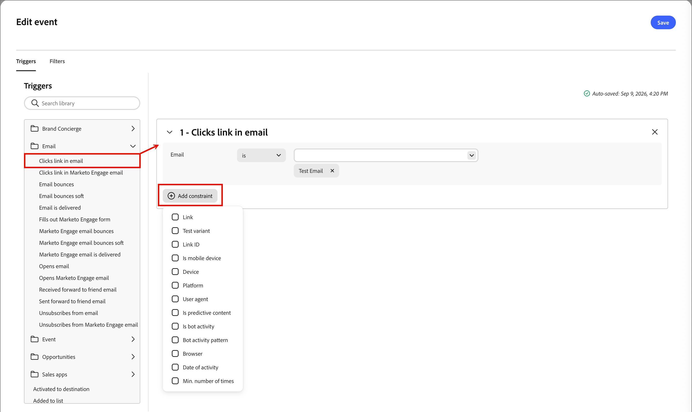

# 侦听事件节点

添加&#x200B;_侦听事件_&#x200B;节点，以便在事件发生时将受众前进到历程中的下一步。

## 事件触发器 {#event-triggers}

您可以针对[!DNL Marketo Engage]活动生成触发器，例如：

* 填写表单 — 当人员在您的登陆页面上提交[!DNL Marketo Engage]表单时触发。
* 访问网页 — 当潜在客户查看跟踪的网页时触发（您可以指定精确的URL或使用通配符）。
* 单击链接 — 在单击营销电子邮件中的跟踪链接时触发。
* 数据值更改 — 在人员记录中更新特定字段（如商机状态、得分或行业）时触发。
* 请求营销活动 — 通常用于API或webhook集成，此触发器将在其他项目或Web服务调用营销活动时启动该活动。
* 分数已更改 — 当个人的商机分数超过特定阈值增加或减少时触发。
* 移动推送点按 — 当推送通知在设备上与交互时，在移动营销智能营销活动中触发。

## 事件过滤器 {#event-filters}

| 过滤器 | 描述 |
| ------- | ----------- |
| 活动历史记录>电子邮件 | 电子邮件活动基于使用一封或多封选定的电子邮件评估的条件： <li>电子邮件中已点击的链接 <li>打开了电子邮件 |
| 活动历史记录>数据值已更改 | 对于选定的人员属性，发生值更改。 这些更改类型包括： <li>新值 <li>上一个值 <li>原因 <li>源 <li>活动日期 <li> 最低 次数 |

## 添加事件节点 {#add-event-node}

1. 导航到历程画布。

1. 单击路径上的加号( **+** )图标，然后选择&#x200B;**[!UICONTROL 侦听事件]**。

   {width="200"}

1. 在右侧的节点属性中，单击&#x200B;**[!UICONTROL 添加事件条件]**。

1. 在&#x200B;_[!UICONTROL 编辑事件]_&#x200B;对话框中，添加要触发的事件。

   {width="600" zoomable="yes"}

1. （可选）在对话框中选择&#x200B;**[!UICONTROL 筛选器]**&#x200B;选项卡，并为触发器添加筛选条件。

1. 单击&#x200B;**[!UICONTROL 编辑事件]**&#x200B;并定义该事件的详细信息。

   {width="600" zoomable="yes"}

1. 单击&#x200B;**[!UICONTROL 保存]**。

<!--
1. If needed, set the **[!UICONTROL Timeout]** option to limit the time period to listen for the event.

   >[!NOTE]
   >
   >The journey ends after a timeout unless you define a timeout path, where you can add other nodes.

   Enable the **[!UICONTROL Timeout]** option and select the duration for which the journey waits for an event to occur before it times out.

   You can choose to end the path here or take a different course of action by setting another path. To create a new path in the journey where you can add actions and events applicable to accounts when the event does not occur, select the **[!UICONTROL Set timeout path]** check box.

   {width="700" zoomable="yes"}
-->

>[!NOTE]
>
>侦听事件节点的超时功能当前不起作用。 计划在以后的版本中发布。

