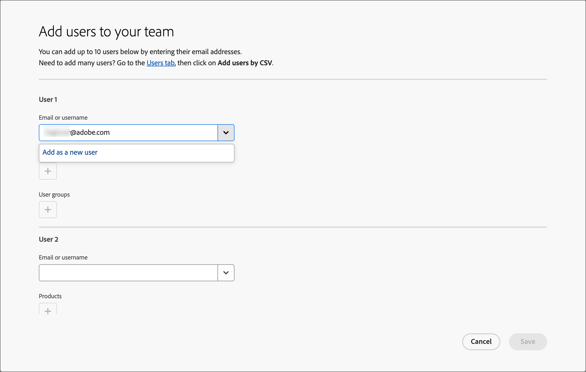
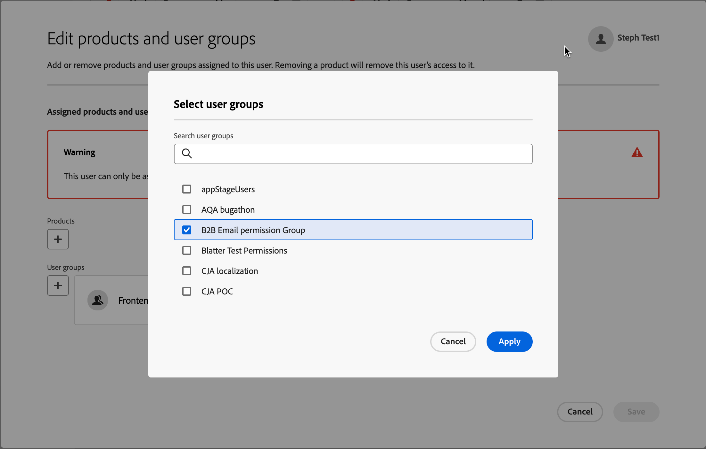
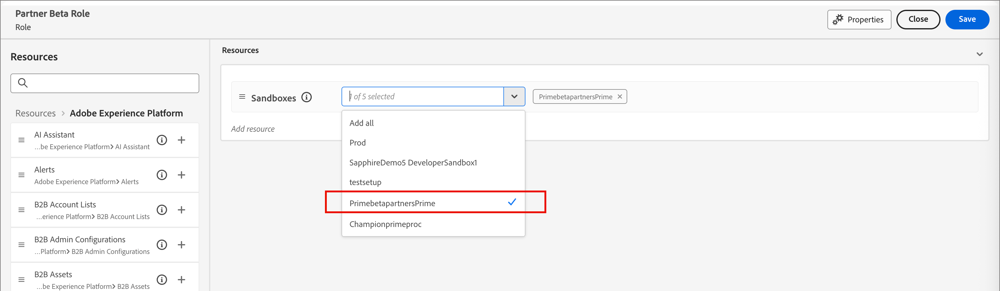
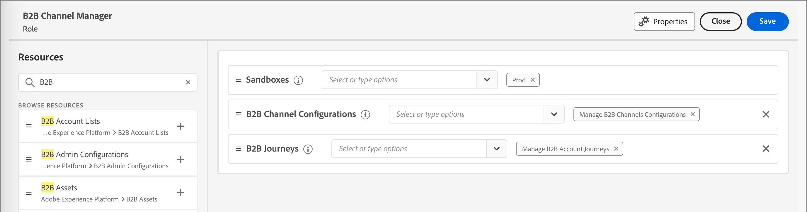

# 用户访问和权限

配置完成并绑定沙盒后，请完成以下步骤为您的团队和用户提供[!DNL Marketo Optimizer]访问权限。

1. [在Admin Console中创建 [!DNL Journey Optimizer B2B Edition] 产品配置文件](#create-profile)（仅限一次性/初始设置）。
1. 在Admin Console中[添加用户组](#add-user-group)。
1. [将产品配置文件](#assign-profile)分配给Admin Console中的用户组。
1. [在Admin Console中将用户添加到新组](#add-users)。
1. [编辑内置角色](#edit-role-permissions)或[在Adobe Experience Platform中创建具有[!DNL Journey Optimizer B2B Edition]权限的自定义角色](#create-a-custom-role)。
1. [将用户](#add-users-to-a-role)或[组](#add-user-groups-to-a-role)添加到Adobe Experience Platform中的角色。

## 配置产品配置文件 {#config-profile}

作为管理员，您可以在[!DNL Adobe Admin Console]中完成这些任务，该位置是管理Adobe产品许可证和用户的中心位置。 在Admin Console中，您可以在单个位置而不是在各种单独的解决方案中创建和管理用户。 要了解有关其功能和功能的更多信息，请参阅[Admin Console概述](https://helpx.adobe.com/business/enterprise/plan-your-deployment/basic-concepts/admin-console.html)页面。

### 访问Admin Console {#admin-console}

在使用Admin Console管理团队中的用户之前，您需要确保可以访问Admin Console并具有适当的权限。

1. 作为系统管理员，您应在载入流程中收到来自Adobe的多封电子邮件。

   找到欢迎电子邮件，其中提供了有关您已被授予访问权限的组织名称的信息。

1. 单击欢迎电子邮件中的&#x200B;**[!UICONTROL 开始使用]**&#x200B;链接以导航到Admin Console。

   如果找不到电子邮件，请直接打开浏览器访问Admin Console，网址为[https://adminconsole.adobe.com](https://adminconsole.adobe.com)。

1. 使用您的Adobe ID登录。

   成功登录后，您会看到Adobe Admin Console的&#x200B;_概述_&#x200B;页面。

1. 如果您有权访问多个组织，请确保您已登录到正确的组织。

   要更改您的组织，请单击右上角的组织名称，然后选择您需要访问的组织。

1. 从&#x200B;_[!UICONTROL 用户]_&#x200B;信息卡中选择&#x200B;**[!UICONTROL 管理员]**&#x200B;以验证您是系统管理员。

   {width="800" zoomable="yes"}

1. 通过输入您的Adobe ID电子邮件、用户名、名字或姓氏进行搜索。

   * 如果您的访问权限配置正确，搜索将返回您的记录。

   * 如果&#x200B;**[!UICONTROL 管理员角色]**&#x200B;列中的值显示`System`，则表示您自己（或显示的用户）是系统管理员。

### 创建[!DNL Journey Optimizer B2B Edition]产品配置文件 {#create-profile}

授予用户访问Adobe解决方案的权限时，您不一定要授予他们完全访问权限。 产品配置文件使每个解决方案都有自己的用户权限集。 使用Admin Console分配产品配置文件。

有关将产品配置文件用于用户权限的详细信息，请参阅Admin Console文档中的&#x200B;[_管理企业用户的产品配置文件_](https://helpx.adobe.com/business/enterprise/manage-products-and-entitlements/manage-products-and-product-profiles/manage-product-profiles.html){target="_blank"}。

{width="30"}系统管理员或[!DNL Experience Platform]产品管理员可以从[https://adminconsole.adobe.com](https://adminconsole.adobe.com)中执行以下步骤。

1. 选择&#x200B;**[!UICONTROL 产品]**&#x200B;选项卡。

1. 打开要添加配置文件的[!DNL Journey Optimizer B2B Edition]实例，然后单击&#x200B;**[!UICONTROL 新建配置文件]**。

   {width="600" zoomable="yes"}

1. 输入产品配置文件名称，如&#x200B;_B2B用户_。

1. 单击&#x200B;**[!UICONTROL 下一步]**，然后单击&#x200B;**[!UICONTROL 保存]**。

### 添加用户群组 {#add-user-group}

用户组是获得一组共享权限的用户集合。 您可以在用户组中添加或删除用户。 当组内的用户发生更改时，组权限保持不变。

有关如何使用用户组管理权限的更多信息，请参阅Admin Console文档中的[管理用户组](https://helpx.adobe.com/business/enterprise/manage-users/user-groups.html){target="_blank"}。

{width="30"}系统管理员可以从[https://adminconsole.adobe.com](https://adminconsole.adobe.com)中执行以下步骤。

1. 选择&#x200B;**[!UICONTROL 用户]**&#x200B;选项卡。

1. 在左侧导航中选择&#x200B;**[!UICONTROL 用户组]**。

1. 单击右上方的&#x200B;**[!UICONTROL 新建用户组]**。

1. 输入用户组的名称，如&#x200B;_B2B用户_，然后单击&#x200B;**[!UICONTROL 保存]**。

   {width="600" zoomable="yes"}

### 分配产品配置文件 {#assign-profile}

{width="30"}产品管理员可以从[https://adminconsole.adobe.com](https://adminconsole.adobe.com)中执行以下步骤。

1. 单击您创建的用户组。

1. 选择&#x200B;**[!UICONTROL 已分配的产品配置文件]**&#x200B;选项卡，然后单击&#x200B;**[!UICONTROL 分配配置文件]**。

1. 单击&#x200B;**+**&#x200B;并添加以下产品的每个实例：

   * [!UICONTROL Adobe Journey Optimizer B2B edition — 用户配置文件]
   * [!UICONTROL Adobe Experience Platform - AEP-Default-All-Users]
   * [!UICONTROL Adobe Experience Platform数据收集 — 默认数据收集所有访问]
   * [!UICONTROL Adobe Experience Platform — 默认的生产所有访问]

   {width="600" zoomable="yes"}

1. 单击&#x200B;**[!UICONTROL 保存]**。

### 将用户添加到新组 {#add-users}

有关用户管理的信息，请参阅Admin Console文档中的&#x200B;[_Adobe Admin Console用户_](https://helpx.adobe.com/business/enterprise/manage-users/users.html){target="_blank"}。

{width="30"}系统管理员或产品管理员可以从[https://adminconsole.adobe.com](https://adminconsole.adobe.com)中执行以下步骤。 产品管理员只能添加其组织中已存在的用户。

1. 如果用户还不是您组织的成员，请添加每个用户：

   * 在&#x200B;_[!UICONTROL 快速链接]_&#x200B;下，单击&#x200B;**[!UICONTROL 添加用户]**。

   * 输入用户的电子邮件地址，然后单击&#x200B;**[!UICONTROL 添加为新用户]**。

     {width="600" zoomable="yes"}

   * 输入名字和姓氏，然后单击&#x200B;**[!UICONTROL 保存]**。

1. 将每个用户添加到组：

   * 单击用户名。

   * 在用户详细信息页面中，滚动到&#x200B;**[!UICONTROL 用户组]**。

   * 单击左侧的&#x200B;_更多_ ( **...** )图标，然后选择&#x200B;**[!UICONTROL 编辑用户组]**。

   * 单击&#x200B;**[!UICONTROL 用户组]**&#x200B;下方的&#x200B;_添加_ (**+**)图标。

     {width="600" zoomable="yes"}

   * 选择您之前创建的用户组，然后单击&#x200B;**[!UICONTROL 应用]**。

   * 单击&#x200B;**[!UICONTROL 保存]**&#x200B;以查看用户更改。

## 分配产品权限 {#assign-product-permissions}

权限是单一的权利，可用于定义分配给产品配置文件的授权。 每个权限都分组在某个功能（如人员历程或内容）下，表示[!DNL Marketo Optimizer]中的功能。

在Adobe Experience Platform的&#x200B;_权限_&#x200B;区域，管理员可以定义用户角色和访问策略，以管理产品应用程序内功能和对象的访问权限。 在此应用程序中，您可以创建和管理角色，并为这些角色分配所需的资源权限。 权限还允许您管理与特定角色关联的沙盒和用户。

有关Experience Platform中角色权限的更多信息，请参阅Experience Platform文档中的[管理角色的权限](https://experienceleague.adobe.com/en/docs/experience-platform/access-control/abac/permissions-ui/permissions){target="_blank"}。

1. 转到[experience.adobe.com](https://experience.adobe.com/)。

1. 在&#x200B;_[!UICONTROL 快速访问]_&#x200B;面板中，选择&#x200B;**[!UICONTROL 权限]**。

   >[!NOTE]
   >
   >如果您没有看到&#x200B;_[!UICONTROL 权限]_，您可能需要单击&#x200B;**[!UICONTROL 查看全部]**&#x200B;并从可用应用程序中选择它。

   {width="700" zoomable="yes"}

### 权限 {#permissions}

以下权限控制对[!DNL Marketo Optimizer]中渠道配置、内容管理和人员历程功能的访问：

| 类别 | 权限 | 描述 |
| -------- | ----------- | ---------- |
| B2B渠道配置 | 查看B2B电子邮件设置 | 查看电子邮件设置（子域、PTR记录、IP池、禁止列表、种子列表、IP预热计划）。 |
| | 管理B2B电子邮件设置 | 配置电子邮件设置（子域、PTR记录、IP池、禁止列表、种子列表、IP预热计划）。 用户发送电子邮件之前需要这些设置。 |
| | 管理 B2B 渠道配置 | 访问左侧导航中的&#x200B;_渠道_&#x200B;菜单项以及所有渠道配置操作。 |
| | 管理B2B WhatsApp预设 | 创建、查看和删除WhatsApp消息预设及关联的短信设置。 |
| B2B历程 | 管理B2B人员历程 | 访问&#x200B;_人员历程_&#x200B;列表和所有人员历程操作。 |
| B2B Assets | 查看内容模板 | 查看内容模板列表和详细信息。 |
| | 管理B2B模板 | 创建、编辑和删除内容模板。 |
| | 查看B2B片段 | 查看内容片段列表和详细信息。 |
| | 管理B2B片段 | 创建、编辑和删除内容片段。 |
| | 发布B2B片段 | 发布内容片段，以在模板、电子邮件和登陆页面中使用。 |
| | 查看B2B Assets | 查看Assets库和资源文件详细信息。 |
| | 管理B2B Assets | 创建、编辑和删除资源文件。 |
| | 查看B2B电子邮件 | 查看电子邮件。 |
| | 管理B2B电子邮件 | 创建、编辑和删除电子邮件。 |
| | 管理B2B消息导出 | 导出电子邮件部分下的消息报表。 |
| Journey Optimizer Library | 管理B2B库项目 | 添加和删除库中保存的表达式。 |
| 数据监管 | 管理B2B删除使用标签 | 查看、创建和删除应用于数据集和架构的数据使用标签(DULE)。 |
| 沙盒管理 | 管理B2B包 | 创建、导出、导入、复制和删除沙盒包。 |

要支持[!DNL Marketo Optimizer]中的外部目标，需要以下权限：

| 类别 | 权限 | 描述 |
| -------- | ----------- | ---------- |
| 仪表板 | 查看标准仪表板 | 对&#x200B;_配置文件_、_目标_&#x200B;和&#x200B;_区段_&#x200B;仪表板的仅查看访问权限。 还允许在左侧导航和&#x200B;_仪表板_&#x200B;清单和集成选项卡中访问&#x200B;_仪表板_。 |
| | 管理标准仪表板 | 添加数据仓库中尚未存在的自定义属性。 |
| 目标 | 查看目标 | 仅查看对&#x200B;_目录_&#x200B;选项卡中的可用目标和&#x200B;_浏览_&#x200B;选项卡中的已验证目标的访问权限。 |
| | 管理目标 | 查看、创建和删除目标连接和目标帐户。 |
| | 激活目标 | 将数据激活到活动目标。 还需要&#x200B;_查看目标_&#x200B;或&#x200B;_管理目标_&#x200B;才能访问此功能。 |
| | 激活没有映射的区段 | 将受众激活到现有目标，而不显示映射步骤。 用户可以在激活工作流中添加和删除受众，但无法添加或删除映射的属性或身份。 访问此函数还需要&#x200B;_查看目标_&#x200B;权限。 |
| | 管理和激活数据集目标 | 查看、创建、编辑和禁用数据集导出流，以及激活活动数据集的数据。 访问此函数还需要&#x200B;_查看目标_&#x200B;权限。 |
| | 目标创作 | 能够使用Adobe Experience Platform Destination SDK创作目标。 |
| 数据监管 | 查看数据使用策略 | 对属于您组织的数据使用策略的仅查看访问权限。 |
| | 管理数据使用策略 | 查看、创建、编辑和删除数据使用策略。 |
| 数据引入 | 查看源 | 对&#x200B;_目录_&#x200B;选项卡中的可用源以及&#x200B;_浏览_&#x200B;选项卡中的已验证源的仅查看访问权限。 |
| | 管理源 | 查看、创建、编辑和禁用源。 |
| 轮廓管理 | 查看配置文件设置 | 对所有配置文件设置的仅查看访问权限。 |
| | 管理配置文件设置 | 查看和编辑所有配置文件设置。 |

<!--

### B2B built-in roles {#b2b-built-in-roles}

When your organization has [!DNL Journey Optimizer B2B Edition] provisioned, Experience Platform includes a set of built-in (default) roles that you can use to manage access to the product capabilities:

| Role | Permissions |
| ---- | ----------- |
| B2B Journey Manager | <li>Manage B2B Journeys <li>Manage B2B Buying Groups <li>Manage B2B Account Lists <li>View B2B Engagement Dashboard <li>View B2B Insights Dashboard |
| B2B Channel Manager | <li>Manage B2B Assets <li>Manage B2B Templates <li>Manage B2B Fragments |
| B2B System Administrator | <li>Manage B2B Channels Configurations <li>Manage B2B Admin Configurations |
| B2B Sales User | <li>View B2B Engagement Dashboard <li>View B2B Buying Groups <li>Access In-CRM Insights |

-->

### 编辑角色权限 {#edit-role-permissions}

对于内置或自定义角色，您可以随时决定添加或删除权限。 如果修改默认或自定义角色，则会影响分配给该角色的每个用户。

>[!IMPORTANT]
>
>[!DNL Marketo Optimizer]访问要求您启用使用以下命名约定配置的特定沙盒： Marketo Engage订阅前缀+ Prime。 例如，如果链接的Marketo Engage订阅前缀为&#x200B;_AcmeAssoc_，则访问[!DNL Marketo Optimizer]所需的沙盒为&#x200B;_AcmeAssocPrime_。

>[!NOTE]
>
>Admin Console系统管理员可以执行这些步骤。

更改角色&#x200B;:_的权限(_T)

1. 在左侧导航中选择&#x200B;**[!UICONTROL 角色]**。

1. 单击&#x200B;**_B2B渠道管理器_**&#x200B;角色名称。

1. 在详细信息页面中，单击右上方的&#x200B;**[!UICONTROL 编辑]**。

   {width="800" zoomable="yes"}

   在角色编辑器中，_[!UICONTROL 资源]_&#x200B;菜单显示应用于Experience Cloud - Platform支持的应用程序的资源列表。

1. 选择为[!DNL Marketo Optimizer]访问权限(`<Marketo subscription prefix>Prime`)配置的沙盒。

   {width="800" zoomable="yes"}

1. 单击每个B2B资源的&#x200B;_添加_&#x200B;图标(**+**)。

   {width="700" zoomable="yes"}

1. 为每个资源添加特定权限，或选择&#x200B;**[!UICONTROL 全部添加]**。

1. 单击&#x200B;**[!UICONTROL 保存]**。

   <!-- {width="700" zoomable="yes"} -->

1. 单击&#x200B;**[!UICONTROL 关闭]**&#x200B;以返回详细信息页面。

### 将用户添加到角色 {#add-users-to-a-role}

{width="30"}系统管理员或Experience Platform管理员可以执行以下步骤。

1. 打开角色详细信息并选择&#x200B;**[!UICONTROL 用户]**&#x200B;选项卡。

   此选项卡显示分配给该角色的所有用户的列表。

1. 单击&#x200B;**[!UICONTROL 添加用户]**。

   {width="800" zoomable="yes"}

1. 在&#x200B;_[!UICONTROL 添加用户]_&#x200B;对话框中，找到并选择要添加到该角色的用户。

   * 您可以使用搜索工具来筛选用户列表。

   * 选中每个用户的复选框。

   {width="600" zoomable="yes"}

1. 选择您要添加的所有用户后，单击&#x200B;**[!UICONTROL 保存]**。

### 将用户组添加到角色 {#add-user-groups-to-a-role}

有关用户管理的信息，请参阅Admin Console文档中的&#x200B;[_Adobe Admin Console用户_](https://helpx.adobe.com/business/enterprise/manage-users/users.html){target="_blank"}。

{width="30"}系统管理员或Experience Platform管理员可以执行以下步骤。

1. 打开角色详细信息并选择&#x200B;**[!UICONTROL 用户组]**&#x200B;选项卡。

   此选项卡显示分配给该角色的所有用户组的列表。

1. 单击&#x200B;**[!UICONTROL 添加群组]**。

   {width="800" zoomable="yes"}

1. 在&#x200B;_[!UICONTROL 添加组]_&#x200B;对话框中，找到并选择要添加到该角色的组。

   * 您可以使用搜索工具筛选用户组列表。

   * 选中每个用户组的复选框。

   {width="600" zoomable="yes"}

1. 选择您要添加的所有组后，单击&#x200B;**[!UICONTROL 保存]**。

### 创建自定义角色 {#create-a-custom-role}

{width="30"}系统管理员或Experience Platform管理员可以执行以下步骤。

1. 在左侧导航中选择&#x200B;**[!UICONTROL 角色]**，然后选择&#x200B;**[!UICONTROL 创建角色]**。

1. 在&#x200B;_[!UICONTROL 创建新角色]_&#x200B;对话框中，输入角色的名称和描述（可选），例如&#x200B;_B2B营销人员_。

1. 单击&#x200B;**[!UICONTROL 确认]**。

1. 选择为[!DNL Marketo Optimizer]访问权限(`<Marketo subscription prefix>Prime`)配置的沙盒。

   {width="800" zoomable="yes"}

1. 添加B2B产品权限：

   要确定您希望角色具有哪些产品功能，请参阅[产品权限](#permissions)列表。

   在左侧的&#x200B;_[!UICONTROL 资源]_&#x200B;列表中，找到B2B项目并单击&#x200B;_添加_ (**+**)图标以添加要为该角色启用的每个属性。

   您可以在搜索工具中输入&#x200B;_B2B_&#x200B;以筛选许多B2B产品权限的列表。

   {width="700" zoomable="yes"}

1. 单击右上方的&#x200B;**[!UICONTROL 保存]**。

1. 转到角色详细信息并选择&#x200B;**[!UICONTROL 用户组]**&#x200B;选项卡。

1. 单击&#x200B;**[!UICONTROL 添加群组]**。

1. 选中您之前在Admin Console中创建的用户组旁边的复选框。

1. 单击&#x200B;**[!UICONTROL 保存]**。

您的自定义角色已配置，并且已分配组中的用户现在可以访问您选择的[!DNL Marketo Optimizer]权能。
